# Architecture

This document explains how NexusLib's database is built: the pieces, the data model (ERDs),
where each business rule is enforced, how concurrent writes stay correct, and the main flows
as sequence diagrams. All diagrams are Mermaid, so GitHub and most editors render them inline.

Sources of truth:
- design: [spec.md](specs/001-library-db-design/spec.md),
  [data-model.md](specs/001-library-db-design/data-model.md),
  [contracts/](specs/001-library-db-design/contracts/);
- implementation: `src/lib/db/schema/` and `drizzle/`.

## 1. System overview

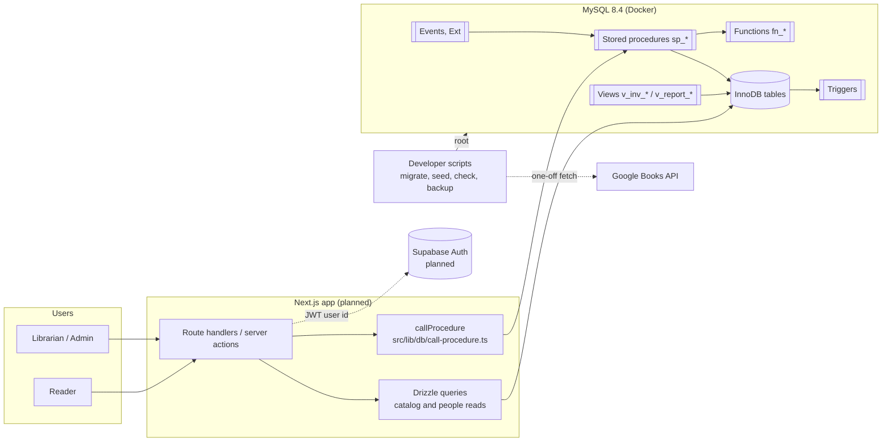
```mermaid
flowchart LR
  subgraph Users
    L[Librarian / Admin]
    R[Reader]
  end
  subgraph App["Next.js app (planned)"]
    API[Route handlers / server actions]
    CP[callProcedure<br/>src/lib/db/call-procedure.ts]
    ORM[Drizzle queries<br/>catalog and people reads]
  end
  SB[(Supabase Auth<br/>planned)]
  subgraph MySQL["MySQL 8.4 (Docker)"]
    SP[[Stored procedures sp_*]]
    FN[[Functions fn_*]]
    TRG[[Triggers]]
    T[(InnoDB tables)]
    V[[Views v_inv_* / v_report_*]]
    EV[[Events, Ext]]
  end
  GB[Google Books API]
  DEV[Developer scripts<br/>migrate, seed, check, backup]

  L --> API
  R --> API
  API -. JWT user id .-> SB
  API --> CP --> SP
  API --> ORM --> T
  SP --> FN
  SP --> T
  T --> TRG
  V --> T
  EV --> SP
  DEV -->|root| MySQL
  DEV -. one-off fetch .-> GB
```

- **Business operations are stored procedures.** Checkout, return, renew, lost, payment,
  adjustment, card and policy changes, copy status changes, and the reservation workflow
  (reserve, cancel, queue promotion, hold expiry) all run in the database, one transaction
  each. The app never changes circulation, reservation or money rows with plain SQL.
- **One scheduled event.** `ev_expire_holds` (Ext) expires overdue holds every 15 minutes
  (flow 18); it needs `event_scheduler=ON`.
- **Two accounts.**
  - **Owner (`root`)** runs migrations, applies grants and owns the routines, which are
    `SQL SECURITY DEFINER`.
  - **App account (`DB_USER`)**:
    - may `SELECT` everything;
    - may write only catalog and people tables (`APP_WRITABLE_TABLES` in
      `src/lib/db/grants.ts`);
    - may `EXECUTE` public routines. Internal helpers named `sp__*` are not granted.
- **Identity.** Supabase (planned) authenticates users. The library keeps `app_users` with the
  Supabase user id, plus its own roles and permissions, which procedures check with
  `fn_has_permission`.
- **Google Books** is called only by a one-off script. The team reviews its output and commits
  it; seeding never calls the network.

## 2. Code layout

| Layer | Location | Notes |
| --- | --- | --- |
| Config | `src/lib/db/config.ts` | `dbConfig('owner' \| 'app', {test, schema})` from env only |
| Pool | `src/lib/db/index.ts` | `mysql2` pool, `timezone: 'Z'`, `innodb_lock_wait_timeout = 5` |
| Procedure calls | `src/lib/db/call-procedure.ts` | retry on 1213/1205, `DbRuleError` for 45000 |
| Tables | `src/lib/db/schema/*.ts` | Drizzle definitions; `tables.ts` re-exports them |
| Migrations | `drizzle/<timestamp>_<name>/migration.sql` | generated DDL plus custom SQL |
| Grants | `scripts/db/grants.ts` | applied after every migrate and restore |
| Seed | `scripts/seed/seed.ts`, `data/seed/` | direct catalog inserts, history via procedures |
| Tests | `tests/db`, `tests/concurrency` | test schema `${DB_NAME}_test`, invariants after each test |

### Migration order

| Group | Migrations |
| --- | --- |
| Tables | `core_tables`, `core_tables_fixups` (FULLTEXT) |
| Data | `reference_data` (material/reader types, roles, permissions) |
| Shared | `functions`, `invariant_views` |
| US1 | `us1_copy_triggers`, `us1_copy_procedures` |
| US2 | `us2_policy_triggers`, `us2_policy_procedures`, `us2_card_procedures` |
| US3 | `us3_loan_item_triggers`, `us3_fine_triggers`, `us3_checkout`, `us3_return_lost`, `us3_renew` |
| US4 | `us4_money_triggers`, `us4_record_payment`, `us4_reports`, `us4_adjustments` |
| Fixes | `null_safe_check_fixes`, `integrity_error_keys` |
| Ext | `ext_reservation_trigger`, `ext_promote_queue` (also re-creates `sp_register_copy`, `sp_change_copy_status`, `sp_return_item`, `sp_checkout`), `ext_reservation_procedures`, `ext_hold_expiry_event` |

**drizzle-kit patch.** In drizzle-kit 1.0.0-rc.4 the MySQL diff ignores a *changed* CHECK
expression (upstream issues #4602, #5730). `patches/drizzle-kit@1.0.0-rc.4.patch` makes
`generate` emit drop + create for it, and `pnpm db:spike` has a regression check. Before
upgrading drizzle-kit, confirm the upstream fix and remove the patch.

## 3. Data model

21 conceptual entities map to 27 relations. The extra 6 are junction tables and one
multi-valued attribute: `book_authors`, `book_categories`, `user_roles`, `role_permissions`,
`fine_payment_allocations` and `book_identifiers`.

The Chen-notation sources are `docs/erd/conceptual.puml` (whole model) and
`docs/erd/views/*.puml` (one view per area). The entity-to-table mapping is in
`docs/erd/mapping.md`.

### 3.1 Conceptual ERD

Entities with their identifying and main attributes. Cardinalities follow the Chen (min,max)
participation in `conceptual.puml`. Ternary relationships are drawn as two binary lines:
`GOVERNS` (policy – reader type – material type) and `REQUESTS` (reservation – reader – book).

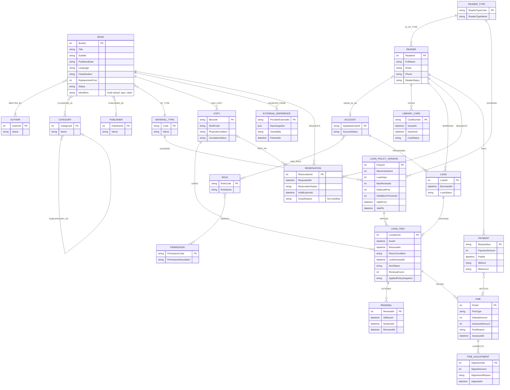
```mermaid
erDiagram
  MATERIAL_TYPE {
    string Code PK
    string Name
  }
  PUBLISHER {
    int PublisherId PK
    string Name
  }
  AUTHOR {
    int AuthorId PK
    string Name
  }
  CATEGORY {
    int CategoryId PK
    string Name
  }
  BOOK {
    int BookId PK
    string Title
    string Subtitle
    string PublishedDate
    string Language
    string Classification
    int ReplacementCost
    string Status
    string Identifiers "multi-valued: type, value"
  }
  COPY {
    string Barcode PK
    string ShelfCode
    string PhysicalCondition
    string CirculationStatus
  }
  EXTERNAL_REFERENCE {
    string ProviderExternalId PK
    json RawSnapshot
    string Viewability
    datetime FetchedAt
  }
  ACCOUNT {
    string SupabaseUserId PK
    string AccountStatus
  }
  ROLE {
    string RoleCode PK
    string RoleName
  }
  PERMISSION {
    string PermissionCode PK
    string PermissionDescription
  }
  READER_TYPE {
    string ReaderTypeCode PK
    string ReaderTypeName
  }
  READER {
    int ReaderId PK
    string FullName
    string Email
    string Phone
    string ReaderStatus
  }
  LIBRARY_CARD {
    string CardNumber PK
    datetime IssuedAt
    datetime ExpiresAt
    string CardStatus
  }
  LOAN_POLICY_VERSION {
    int PolicyId PK
    int MaxActiveItems
    int LoanDays
    int MaxRenewals
    int DailyLateFee
    int DebtBlockThreshold
    datetime ValidFrom
    datetime ValidTo
  }
  LOAN {
    int LoanId PK
    datetime BorrowedAt
    string LoanStatus
  }
  LOAN_ITEM {
    int LoanItemId PK
    datetime DueAt
    datetime ReturnedAt
    string ReturnCondition
    datetime LostDeclaredAt
    string ItemStatus
    int RenewalCount
    string AppliedPolicySnapshot
  }
  RENEWAL {
    int RenewalId PK
    datetime OldDueAt
    datetime NewDueAt
    datetime RenewedAt
  }
  RESERVATION {
    int ReservationId PK
    datetime RequestedAt
    string ReservationStatus
    datetime HoldExpiresAt
    string CloseReason "Ext workflow"
  }
  FINE {
    int FineId PK
    string FineType
    int DefaultAmount
    int AssessedAmount
    string FineReason
    datetime AssessedAt
  }
  FINE_ADJUSTMENT {
    int AdjustmentId PK
    int SignedAmount
    string AdjustmentReason
    datetime AdjustedAt
  }
  PAYMENT {
    string RequestKey PK
    int PaymentAmount
    datetime PaidAt
    string Method
    string Reference
  }

  BOOK }o--|{ AUTHOR : "WRITTEN_BY"
  BOOK }o--o{ CATEGORY : "CLASSIFIED_IN"
  CATEGORY }o--o| CATEGORY : "SUBCATEGORY_OF"
  BOOK }o--o| PUBLISHER : "PUBLISHED_BY"
  BOOK }o--|| MATERIAL_TYPE : "OF_TYPE"
  BOOK ||--o{ COPY : "HAS_COPY"
  BOOK ||--o{ EXTERNAL_REFERENCE : "SOURCED_FROM"
  READER |o--o| ACCOUNT : "SIGNS_IN_AS"
  READER_TYPE ||--o{ READER : "IS_OF_TYPE"
  READER ||--o{ LIBRARY_CARD : "HOLDS"
  ACCOUNT }o--o{ ROLE : "HAS_ROLE"
  ROLE }o--o{ PERMISSION : "GRANTS"
  READER_TYPE ||--o{ LOAN_POLICY_VERSION : "GOVERNS"
  MATERIAL_TYPE ||--o{ LOAN_POLICY_VERSION : "GOVERNS"
  READER ||--o{ LOAN : "BORROWS"
  ACCOUNT ||--o{ LOAN : "PROCESSES"
  LOAN ||--|{ LOAN_ITEM : "CONTAINS"
  COPY ||--o{ LOAN_ITEM : "LENDS"
  LOAN_POLICY_VERSION ||--o{ LOAN_ITEM : "APPLIES"
  LOAN_ITEM ||--o{ RENEWAL : "EXTENDS"
  READER ||--o{ RESERVATION : "REQUESTS"
  BOOK ||--o{ RESERVATION : "REQUESTS"
  COPY |o--o{ RESERVATION : "HELD_AS"
  LOAN_ITEM ||--o{ FINE : "INCURS"
  FINE ||--o{ FINE_ADJUSTMENT : "CORRECTS"
  READER ||--o{ PAYMENT : "PAYS"
  PAYMENT }o--|{ FINE : "SETTLES"
```

### 3.2 Relational ERD (crow's foot, all 27 tables)

Generated from the migrated schema by `pnpm erd:relational`, which writes
`docs/erd/relational.mmd` and refreshes the block below. Do not edit the block by hand: the
test `tests/db/us6-erd-sync.test.ts` fails if either copy differs from the schema.

<!-- erd:relational:start -->

```mermaid
erDiagram
  app_users {
    bigint id PK
    char supabase_user_id UK
    enum status
    datetime created_at
  }
  authors {
    bigint id PK
    varchar name
  }
  book_authors {
    bigint book_id PK, FK
    bigint author_id PK, FK
    tinyint author_order
  }
  book_categories {
    bigint book_id PK, FK
    bigint category_id PK, FK
  }
  book_copies {
    bigint id PK
    bigint book_id FK
    varchar barcode UK
    varchar shelf_code "nullable"
    date acquired_at "nullable"
    enum physical_condition
    enum circulation_status
    datetime created_at
    datetime updated_at
  }
  book_external_refs {
    bigint id PK
    bigint book_id FK
    enum provider
    varchar external_id
    varchar source_url "nullable"
    enum viewability "nullable"
    tinyint embeddable "nullable"
    varchar web_reader_link "nullable"
    char access_country "nullable"
    json raw_snapshot
    datetime fetched_at
  }
  book_identifiers {
    bigint id PK
    bigint book_id FK
    enum identifier_type
    varchar identifier_value
  }
  books {
    bigint id PK
    varchar title
    varchar subtitle "nullable"
    bigint publisher_id FK "nullable"
    varchar published_date_text "nullable"
    smallint published_year "nullable"
    text description "nullable"
    varchar language_code "nullable"
    varchar cover_url "nullable"
    bigint material_type_id FK
    varchar classification_code "nullable"
    bigint replacement_cost_vnd "nullable"
    enum status
    datetime created_at
    datetime updated_at
  }
  categories {
    bigint id PK
    varchar name
    bigint parent_id FK "nullable"
  }
  fine_adjustments {
    bigint id PK
    bigint fine_id FK
    bigint amount_vnd
    varchar reason
    bigint adjusted_by_user_id FK
    datetime adjusted_at
  }
  fine_payment_allocations {
    bigint payment_id PK, FK
    bigint fine_id PK, FK
    bigint amount_vnd
  }
  fine_payments {
    bigint id PK
    bigint reader_id FK
    bigint received_by_user_id FK
    bigint amount_vnd
    datetime paid_at
    enum method
    varchar reference_no "nullable"
    varchar request_key UK
    datetime created_at
  }
  fines {
    bigint id PK
    bigint loan_item_id FK
    enum fine_type
    bigint default_amount_vnd
    bigint assessed_amount_vnd
    varchar reason "nullable"
    datetime assessed_at
    bigint assessed_by_user_id FK
  }
  library_cards {
    bigint id PK
    bigint reader_id FK
    varchar card_number UK
    datetime issued_at
    datetime expires_at
    enum status
    datetime created_at
    bigint active_reader_id UK "nullable, generated"
  }
  loan_items {
    bigint id PK
    bigint loan_id FK
    bigint copy_id FK
    bigint policy_id FK
    datetime borrowed_at
    datetime due_at
    datetime returned_at "nullable"
    enum return_condition "nullable"
    datetime lost_declared_at "nullable"
    enum status
    smallint renewal_count
    smallint applied_loan_days
    smallint applied_max_renewals
    bigint applied_daily_fee_vnd
    bigint open_copy_id UK "nullable, generated"
  }
  loan_policies {
    bigint id PK
    bigint reader_type_id FK
    bigint material_type_id FK
    smallint max_active_items
    smallint loan_days
    smallint max_renewals
    bigint daily_late_fee_vnd
    bigint debt_block_threshold_vnd
    datetime valid_from
    datetime valid_to "nullable"
    bigint created_by_user_id FK
    datetime created_at
  }
  loan_renewals {
    bigint id PK
    bigint loan_item_id FK
    datetime old_due_at
    datetime new_due_at
    datetime renewed_at
    bigint performed_by_user_id FK
  }
  loans {
    bigint id PK
    bigint reader_id FK
    bigint processed_by_user_id FK
    datetime borrowed_at
    enum status
    datetime created_at
  }
  material_types {
    bigint id PK
    varchar code UK
    varchar name
  }
  permissions {
    bigint id PK
    varchar code UK
    varchar description
  }
  publishers {
    bigint id PK
    varchar name
  }
  reader_types {
    bigint id PK
    varchar code UK
    varchar name
  }
  readers {
    bigint id PK
    bigint user_id FK, UK "nullable"
    bigint reader_type_id FK
    varchar full_name
    varchar email "nullable"
    varchar phone "nullable"
    enum status
    datetime created_at
  }
  reservations {
    bigint id PK
    bigint reader_id FK
    bigint book_id FK
    datetime requested_at
    enum status
    bigint assigned_copy_id FK "nullable"
    datetime ready_at "nullable"
    datetime hold_expires_at "nullable"
    bigint fulfilled_loan_item_id FK, UK "nullable"
    datetime closed_at "nullable"
    varchar close_reason "nullable"
    enum closed_by_kind "nullable"
    bigint closed_by_user_id FK "nullable"
    tinyint active_flag "nullable, generated"
    bigint ready_copy_id UK "nullable, generated"
  }
  role_permissions {
    bigint role_id PK, FK
    bigint permission_id PK, FK
  }
  roles {
    bigint id PK
    varchar code UK
    varchar name
  }
  user_roles {
    bigint user_id PK, FK
    bigint role_id PK, FK
  }
  authors ||--o{ book_authors : "author_id"
  books ||--o{ book_authors : "book_id"
  books ||--o{ book_categories : "book_id"
  categories ||--o{ book_categories : "category_id"
  books ||--o{ book_copies : "book_id"
  books ||--o{ book_external_refs : "book_id"
  books ||--o{ book_identifiers : "book_id"
  material_types ||--o{ books : "material_type_id"
  publishers |o--o{ books : "publisher_id"
  categories |o--o{ categories : "parent_id"
  app_users ||--o{ fine_adjustments : "adjusted_by_user_id"
  fines ||--o{ fine_adjustments : "fine_id"
  fines ||--o{ fine_payment_allocations : "fine_id"
  fine_payments ||--o{ fine_payment_allocations : "payment_id"
  readers ||--o{ fine_payments : "reader_id"
  app_users ||--o{ fine_payments : "received_by_user_id"
  app_users ||--o{ fines : "assessed_by_user_id"
  loan_items ||--o{ fines : "loan_item_id"
  readers ||--o{ library_cards : "reader_id"
  book_copies ||--o{ loan_items : "copy_id"
  loans ||--o{ loan_items : "loan_id"
  loan_policies ||--o{ loan_items : "policy_id"
  app_users ||--o{ loan_policies : "created_by_user_id"
  material_types ||--o{ loan_policies : "material_type_id"
  reader_types ||--o{ loan_policies : "reader_type_id"
  loan_items ||--o{ loan_renewals : "loan_item_id"
  app_users ||--o{ loan_renewals : "performed_by_user_id"
  app_users ||--o{ loans : "processed_by_user_id"
  readers ||--o{ loans : "reader_id"
  reader_types ||--o{ readers : "reader_type_id"
  app_users |o--o| readers : "user_id"
  books ||--o{ reservations : "book_id"
  app_users |o--o{ reservations : "closed_by_user_id"
  book_copies |o--o{ reservations : "assigned_copy_id, book_id"
  loan_items |o--o| reservations : "fulfilled_loan_item_id"
  readers ||--o{ reservations : "reader_id"
  permissions ||--o{ role_permissions : "permission_id"
  roles ||--o{ role_permissions : "role_id"
  roles ||--o{ user_roles : "role_id"
  app_users ||--o{ user_roles : "user_id"
```

<!-- erd:relational:end -->

### 3.3 Key design decisions

- **Surrogate keys** (`BIGINT` auto-increment) everywhere. Natural keys (barcode, card number,
  role code, request key, provider + external id) have their own UNIQUE constraints.
- **One open loan per copy, one active card per reader**: partial uniqueness through STORED
  generated columns with a UNIQUE index:
  - `loan_items.open_copy_id` is set only while the item is `on_loan`;
  - `library_cards.active_reader_id` is set only while the card is `active`;
  - `reservations.active_flag` and `ready_copy_id` do the same for reservations (Ext).
- **Policy versions**: each `loan_items` row points to the `loan_policies` version in force at
  borrow time and copies the values it applied (`applied_*`). Closing a version or creating a
  new one never changes existing loans.
- **Money is append-only**: fines, adjustments, payments and allocations are never updated or
  deleted. Triggers reject such changes even for the owner. Balances are derived
  (`fn_fine_net`, `fn_fine_remaining`, `fn_reader_outstanding`).
- **Time and money**: every instant is UTC `DATETIME(3)`. Library-local rules (due at
  23:59:59.999 local, days late, month boundaries) convert with UTC+07:00. Money is `BIGINT`
  VND.
- **Identifiers are not globally unique**: `book_identifiers` is unique per book only
  (FR-003). Duplicates across books are resolved by people, not by the schema.

## 4. Lifecycles

### Copy circulation status

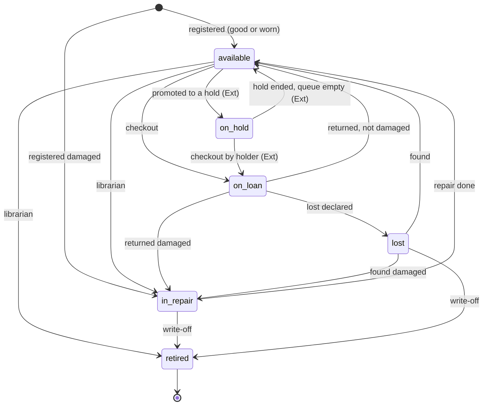
```mermaid
stateDiagram-v2
  [*] --> available : registered (good or worn)
  [*] --> in_repair : registered damaged
  available --> on_loan : checkout
  available --> in_repair : librarian
  available --> retired : librarian
  on_loan --> available : returned, not damaged
  on_loan --> in_repair : returned damaged
  on_loan --> lost : lost declared
  in_repair --> available : repair done
  in_repair --> retired : write-off
  lost --> available : found
  lost --> in_repair : found damaged
  lost --> retired : write-off
  available --> on_hold : promoted to a hold (Ext)
  on_hold --> on_loan : checkout by holder (Ext)
  on_hold --> available : hold ended, queue empty (Ext)
  retired --> [*]
```

`trg_book_copies_bu` rejects any other transition, and a CHECK rejects a `damaged` copy in a
lendable status. The (Ext) transitions are made by `sp__promote_queue` and `sp_checkout`
(flows 15–18). A copy that becomes lendable through return, registration, repair done or found
is set `available` and then, in the same transaction, `on_hold` when the book's queue has an
eligible reader. When a hold ends (cancelled or expired) and another reader is waiting, the
copy stays `on_hold` for that reader.

### Loan item, loan, card, reservation

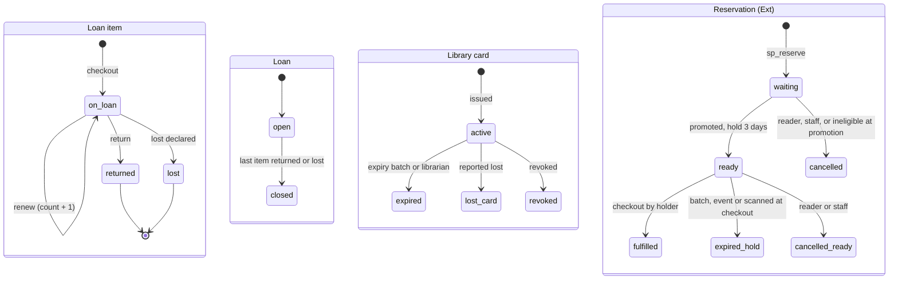
```mermaid
stateDiagram-v2
  state "Loan item" as LI {
    [*] --> on_loan : checkout
    on_loan --> on_loan : renew (count + 1)
    on_loan --> returned : return
    on_loan --> lost : lost declared
    returned --> [*]
    lost --> [*]
  }
  state "Loan" as LO {
    [*] --> open
    open --> closed : last item returned or lost
  }
  state "Library card" as LC {
    [*] --> active : issued
    active --> expired : expiry batch or librarian
    active --> lost_card : reported lost
    active --> revoked : revoked
  }
  state "Reservation (Ext)" as RS {
    [*] --> waiting : sp_reserve
    waiting --> ready : promoted, hold 3 days
    waiting --> cancelled : reader, staff, or ineligible at promotion
    ready --> fulfilled : checkout by holder
    ready --> expired_hold : batch, event or scanned at checkout
    ready --> cancelled_ready : reader or staff
  }
```

In the diagram, `lost_card`, `expired_hold` and `cancelled_ready` are the enum values `lost`,
`expired` and `cancelled`; they are renamed only to keep the Mermaid state names unique.
A card never returns to `active`: `sp_set_card_status` allows only `active → expired | lost |
revoked`, and a reader gets a new card instead. `trg_reservations_bu` enforces the reservation
transitions and rejects a change of reader or book (`INVALID_TRANSITION`).

## 5. Where rules are enforced

Each rule is enforced at the lowest layer that can do it. The full list with test ids is the
Rule Enforcement Matrix in [spec.md](specs/001-library-db-design/spec.md#rule-enforcement-matrix).

| Layer | Used for | Examples |
| --- | --- | --- |
| Column types, NOT NULL, FK | Shape and references | `ON DELETE RESTRICT` everywhere |
| CHECK | Row-local rules | positive amounts, `hold_expires_at IS NOT NULL` when ready, damaged ≠ lendable |
| UNIQUE (incl. generated columns) | "At most one" rules | one open loan item per copy, one active card per reader, one active reservation per reader and book, one ready hold per copy, payment request key |
| Triggers (BEFORE) | Cross-row or history rules | policy overlap and immutability, copy and reservation transitions, append-only money, allocation ≤ remaining |
| Procedures | Multi-step business decisions | eligibility, due dates, fines, payment allocation, idempotency, queue promotion |
| Privileges | No bypass by the app | the app account cannot write procedure-only tables (error 1142) |
| Invariant views | Detection, for tests and ops | 9 `v_inv_*` views; each must return 0 rows |

Rejections use `SIGNAL SQLSTATE '45000'` with `KEY: detail` messages, e.g. `COPY_NOT_AVAILABLE`,
`DEBT_BLOCKED`, `RENEWAL_REJECTED: limit`, `POLICY_OVERLAP`. `callProcedure` turns them into
`DbRuleError { key, detail }` for the app.

## 6. Concurrency

- Every procedure runs one transaction and makes decisions only on **locking reads**
  (`FOR UPDATE` / `FOR SHARE`). A plain read cannot be used for a decision. The one deliberate
  exception is the hard-eligibility check in `sp__promote_queue` (reader status, valid card):
  it runs after the book lock, so locking readers or cards there would invert the lock order,
  and a stale answer can only give a hold that later expires, because checkout re-checks the
  holder under its own locks (flow 15).
- Every writer of a book's copies or reservations locks the `books` row first, so reserve,
  cancel, return, checkout, renew and hold expiry on the same book run one after the other
  (CT-9…CT-12).
- **Global lock order**: reader type → reader → card → book → copy → policy → loan →
  loan item → reservation → fine. Multi-row sets are locked in ascending id.
- Every procedure has `EXIT HANDLER FOR SQLEXCEPTION BEGIN ROLLBACK; RESIGNAL; END`, so an
  error never leaves partial rows. The cursor batches (`sp_expire_cards`,
  `sp__expire_holds_batch`) commit one row at a time, so an error undoes only the current row.
- `callProcedure` retries only deadlock (1213) and lock wait timeout (1205), with a new
  connection and a 50–200 ms random back-off. Business rejections are never retried.
- Tests `tests/concurrency/ct-*` race two real sessions behind a gate session. They wait for
  the lock waits in `performance_schema.data_lock_waits`, then check the invariant views after
  each of 20 runs.

## 7. Flows

Each operation is one procedure call made through `callProcedure`. Flow 1 shows the shared retry and error mapping once. Participants are the actor, the planned Next.js API, `callProcedure`, the procedure and its internal `sp__*` helpers, InnoDB tables, triggers and functions; flow 18 also shows the event scheduler. Flows 14–18 cover the reservation extension (Ext).

### 1. Calling convention and retry

Every business write goes through one TypeScript helper, `callProcedure` (`src/lib/db/call-procedure.ts`). It takes a fresh pooled connection for each attempt and never runs inside a caller's transaction. It sets a 5 s lock wait timeout and issues `CALL sp_xxx(?, …, @out…)`. The procedure checks permissions, owns its transaction, and on any error runs `ROLLBACK` and then `RESIGNAL`. The helper retries only deadlocks and lock wait timeouts. It turns business rejections into a typed `DbRuleError`.

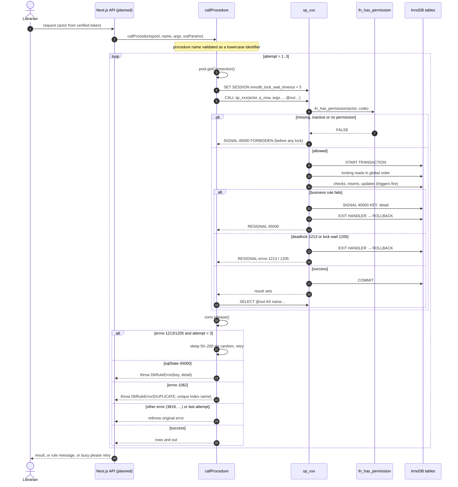
```mermaid
sequenceDiagram
    autonumber
    actor Librarian
    participant App as Next.js API (planned)
    participant CP as callProcedure
    participant SP as sp_xxx
    participant FN as fn_has_permission
    participant DB as InnoDB tables

    Librarian->>App: request (actor from verified token)
    App->>CP: callProcedure(pool, name, args, outParams)
    Note over CP: procedure name validated as a lowercase identifier
    loop attempt = 1..3
        CP->>CP: pool.getConnection()
        CP->>SP: SET SESSION innodb_lock_wait_timeout = 5
        CP->>SP: CALL sp_xxx(actor, p_now, args…, @out…)
        SP->>FN: fn_has_permission(actor, code)
        alt missing, inactive or no permission
            FN-->>SP: FALSE
            SP-->>CP: SIGNAL 45000 FORBIDDEN (before any lock)
        else allowed
            SP->>DB: START TRANSACTION
            SP->>DB: locking reads in global order
            SP->>DB: checks, inserts, updates (triggers fire)
            alt business rule fails
                SP->>DB: SIGNAL 45000 KEY: detail
                SP->>DB: EXIT HANDLER → ROLLBACK
                SP-->>CP: RESIGNAL 45000
            else deadlock 1213 or lock wait 1205
                SP->>DB: EXIT HANDLER → ROLLBACK
                SP-->>CP: RESIGNAL errno 1213 / 1205
            else success
                SP->>DB: COMMIT
                SP-->>CP: result sets
                CP->>SP: SELECT @out AS name…
            end
        end
        CP->>CP: conn.release()
        alt errno 1213/1205 and attempt < 3
            CP->>CP: sleep 50–200 ms random, retry
        else sqlState 45000
            CP-->>App: throw DbRuleError(key, detail)
        else errno 1062
            CP-->>App: throw DbRuleError(DUPLICATE, unique index name)
        else other error (3819, …) or last attempt
            CP-->>App: rethrow original error
        else success
            CP-->>App: rows and out
        end
    end
    App-->>Librarian: result, or rule message, or busy please retry
```

- Call with autocommit on and no open transaction: the procedure's own `START TRANSACTION` would silently commit an open one.
- `p_now DATETIME(3)` (UTC) drives every business time. Procedures never use `NOW()` to make a decision.
- Global lock order: reader type → reader → card → book → copy → policy → loan → loan item → reservation → fine. Rows of one kind are locked in ascending id.
- Retries cover only 1213 and 1205, with up to 3 attempts in total. Business rejections are never retried.
- The message format `KEY: detail` becomes `DbRuleError.key` and `.detail`. A duplicate key (1062) becomes `DbRuleError` with key `DUPLICATE` and the unique index name as detail (e.g. `library_cards_active_reader_uq`). Other errors pass through unchanged.
- The app account (`DB_USER`) has SELECT on everything and write access only to catalog and people tables. It has EXECUTE only on public `fn_*`/`sp_*` routines, not the internal `sp__*` helpers.

### 2. Register a copy and change copy status

A librarian adds a physical copy with `sp_register_copy`. A copy registered in `damaged` condition starts as `in_repair`, and any other copy starts as `available` and goes to the book's reservation queue first (`sp__promote_queue`, flow 15), so it may end up `on_hold`. The maintenance changes (repair, repair done, found, retire) go through `sp_change_copy_status`. The BEFORE UPDATE trigger `trg_book_copies_bu` enforces the copy lifecycle even if the procedure's checks are bypassed.

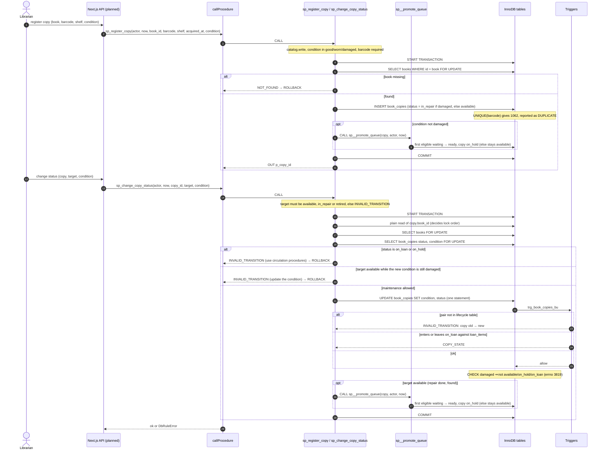
```mermaid
sequenceDiagram
    autonumber
    actor Librarian
    participant App as Next.js API (planned)
    participant CP as callProcedure
    participant SP as sp_register_copy / sp_change_copy_status
    participant PQ as sp__promote_queue
    participant DB as InnoDB tables
    participant TRG as Triggers

    Librarian->>App: register copy (book, barcode, shelf, condition)
    App->>CP: sp_register_copy(actor, now, book_id, barcode, shelf, acquired_at, condition)
    CP->>SP: CALL
    Note over SP: catalog.write, condition in good/worn/damaged, barcode required
    SP->>DB: START TRANSACTION
    SP->>DB: SELECT books WHERE id = book FOR UPDATE
    alt book missing
        SP-->>CP: NOT_FOUND → ROLLBACK
    else found
        SP->>DB: INSERT book_copies (status = in_repair if damaged, else available)
        Note over DB: UNIQUE(barcode) gives 1062, reported as DUPLICATE
        opt condition not damaged
            SP->>PQ: CALL sp__promote_queue(copy, actor, now)
            PQ->>DB: first eligible waiting → ready, copy on_hold (else stays available)
        end
        SP->>DB: COMMIT
        SP-->>CP: OUT p_copy_id
    end

    Librarian->>App: change status (copy, target, condition)
    App->>CP: sp_change_copy_status(actor, now, copy_id, target, condition)
    CP->>SP: CALL
    Note over SP: target must be available, in_repair or retired, else INVALID_TRANSITION
    SP->>DB: START TRANSACTION
    SP->>DB: plain read of copy.book_id (decides lock order)
    SP->>DB: SELECT books FOR UPDATE
    SP->>DB: SELECT book_copies status, condition FOR UPDATE
    alt status is on_loan or on_hold
        SP-->>CP: INVALID_TRANSITION (use circulation procedures) → ROLLBACK
    else target available while the new condition is still damaged
        SP-->>CP: INVALID_TRANSITION (update the condition) → ROLLBACK
    else maintenance allowed
        SP->>DB: UPDATE book_copies SET condition, status (one statement)
        DB->>TRG: trg_book_copies_bu
        alt pair not in lifecycle table
            TRG-->>SP: INVALID_TRANSITION: copy old → new
        else enters or leaves on_loan against loan_items
            TRG-->>SP: COPY_STATE
        else ok
            TRG-->>DB: allow
        end
        Note over DB: CHECK damaged ⇒ not available/on_hold/on_loan (errno 3819)
        opt target available (repair done, found)
            SP->>PQ: CALL sp__promote_queue(copy, actor, now)
            PQ->>DB: first eligible waiting → ready, copy on_hold (else stays available)
        end
        SP->>DB: COMMIT
    end
    CP-->>App: ok or DbRuleError
```

- The trigger allows only these status changes: `available → on_loan | on_hold | in_repair | retired`, `on_loan → available | on_hold | in_repair | lost`, `on_hold → available | on_loan`, `in_repair → available | on_hold | retired` and `lost → available | on_hold | in_repair | retired`. `retired` is terminal.
- `COPY_STATE` (I-1): a copy can become `on_loan` only when it has an open loan item, and can stop being `on_loan` only when it has none.
- A still-damaged copy cannot be made available: the procedure rejects it with `INVALID_TRANSITION`, and the CHECK `book_copies_damaged_not_lendable_ck` (I-7, errno 3819) backs this up for raw SQL. A repair must set `condition` to `good` or `worn` in the same call.
- [Ext] A copy that becomes lendable here (new good/worn copy, repair done, found) is offered to the book's waiting reservations before anyone can borrow it (FR-006a, FR-014b). Lock order: book → copy → queue.
- Error keys: `FORBIDDEN`, `VALIDATION`, `NOT_FOUND`, `INVALID_TRANSITION`, `COPY_STATE`.

### 3. Create and close a policy version

Loan rules are versioned per (reader type, material type) pair, and each version covers a half-open period `[valid_from, valid_to)`. To change the rules, an admin closes the current version and then creates the next one. The procedures serialize on the `reader_types` row. Triggers stop versions from overlapping and stop business values from being edited.

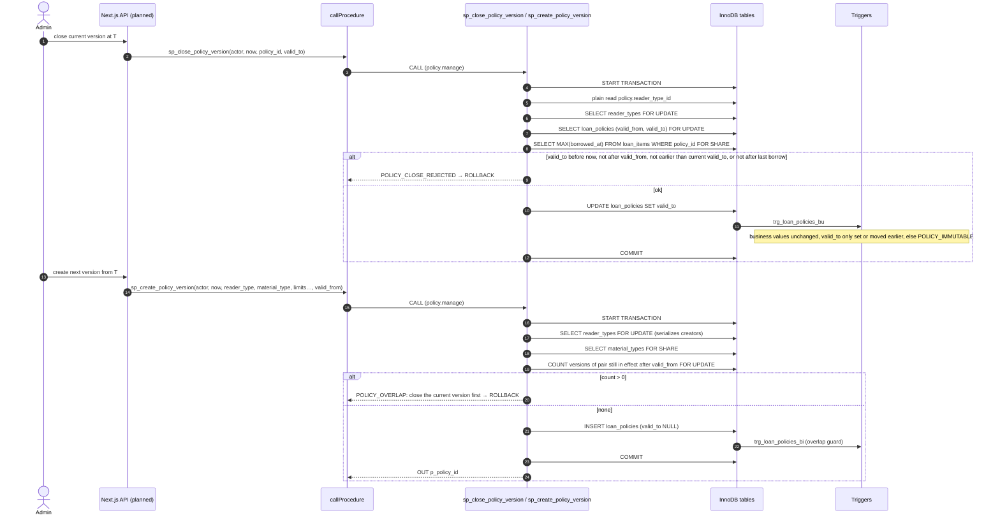
```mermaid
sequenceDiagram
    autonumber
    actor Admin
    participant App as Next.js API (planned)
    participant CP as callProcedure
    participant SP as sp_close_policy_version / sp_create_policy_version
    participant DB as InnoDB tables
    participant TRG as Triggers

    Admin->>App: close current version at T
    App->>CP: sp_close_policy_version(actor, now, policy_id, valid_to)
    CP->>SP: CALL (policy.manage)
    SP->>DB: START TRANSACTION
    SP->>DB: plain read policy.reader_type_id
    SP->>DB: SELECT reader_types FOR UPDATE
    SP->>DB: SELECT loan_policies (valid_from, valid_to) FOR UPDATE
    SP->>DB: SELECT MAX(borrowed_at) FROM loan_items WHERE policy_id FOR SHARE
    alt valid_to before now, not after valid_from, not earlier than current valid_to, or not after last borrow
        SP-->>CP: POLICY_CLOSE_REJECTED → ROLLBACK
    else ok
        SP->>DB: UPDATE loan_policies SET valid_to
        DB->>TRG: trg_loan_policies_bu
        Note over TRG: business values unchanged, valid_to only set or moved earlier, else POLICY_IMMUTABLE
        SP->>DB: COMMIT
    end

    Admin->>App: create next version from T
    App->>CP: sp_create_policy_version(actor, now, reader_type, material_type, limits…, valid_from)
    CP->>SP: CALL (policy.manage)
    SP->>DB: START TRANSACTION
    SP->>DB: SELECT reader_types FOR UPDATE (serializes creators)
    SP->>DB: SELECT material_types FOR SHARE
    SP->>DB: COUNT versions of pair still in effect after valid_from FOR UPDATE
    alt count > 0
        SP-->>CP: POLICY_OVERLAP: close the current version first → ROLLBACK
    else none
        SP->>DB: INSERT loan_policies (valid_to NULL)
        DB->>TRG: trg_loan_policies_bi (overlap guard)
        SP->>DB: COMMIT
        SP-->>CP: OUT p_policy_id
    end
```

- Versions of one pair must not overlap (R-09a). The procedure checks this under the reader-type lock, and `trg_loan_policies_bi` guards it again. `v_inv_cards_policies` (I-8) reports any overlap that gets through.
- Business values are immutable (R-09c, `POLICY_IMMUTABLE`). A version that a loan item references cannot be deleted because of the FK `RESTRICT` (R-09d).
- A close cannot be retroactive, and it must come after every borrow made under that version (R-09e). Because this check reads loan items `FOR SHARE`, a close and a checkout at the same moment serialize (CT-6).
- Error keys: `FORBIDDEN`, `VALIDATION`, `NOT_FOUND`, `POLICY_OVERLAP`, `POLICY_CLOSE_REJECTED`, `POLICY_IMMUTABLE`.

### 4. Issue a card and set card status

A reader can hold at most one `active` card. The database enforces this with a unique index on a generated column (`active_reader_id = IF(status='active', reader_id, NULL)`). Issuing a card and changing its status both lock the reader first, then the reader's cards.

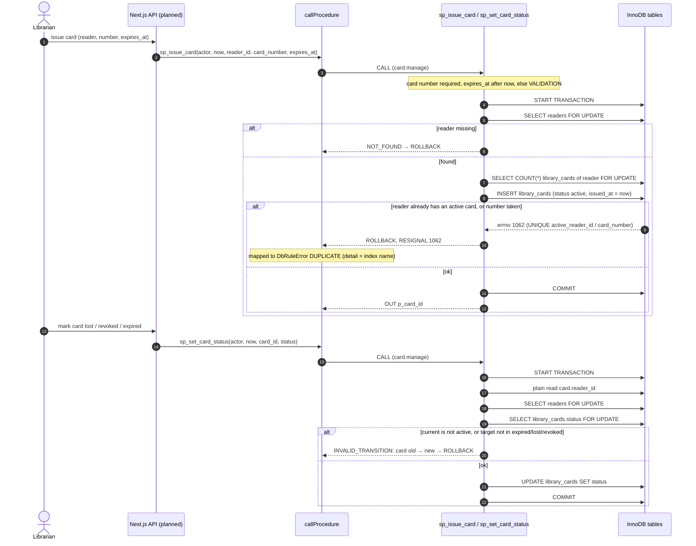
```mermaid
sequenceDiagram
    autonumber
    actor Librarian
    participant App as Next.js API (planned)
    participant CP as callProcedure
    participant SP as sp_issue_card / sp_set_card_status
    participant DB as InnoDB tables

    Librarian->>App: issue card (reader, number, expires_at)
    App->>CP: sp_issue_card(actor, now, reader_id, card_number, expires_at)
    CP->>SP: CALL (card.manage)
    Note over SP: card number required, expires_at after now, else VALIDATION
    SP->>DB: START TRANSACTION
    SP->>DB: SELECT readers FOR UPDATE
    alt reader missing
        SP-->>CP: NOT_FOUND → ROLLBACK
    else found
        SP->>DB: SELECT COUNT(*) library_cards of reader FOR UPDATE
        SP->>DB: INSERT library_cards (status active, issued_at = now)
        alt reader already has an active card, or number taken
            DB-->>SP: errno 1062 (UNIQUE active_reader_id / card_number)
            SP-->>CP: ROLLBACK, RESIGNAL 1062
            Note over CP: mapped to DbRuleError DUPLICATE (detail = index name)
        else ok
            SP->>DB: COMMIT
            SP-->>CP: OUT p_card_id
        end
    end

    Librarian->>App: mark card lost / revoked / expired
    App->>CP: sp_set_card_status(actor, now, card_id, status)
    CP->>SP: CALL (card.manage)
    SP->>DB: START TRANSACTION
    SP->>DB: plain read card.reader_id
    SP->>DB: SELECT readers FOR UPDATE
    SP->>DB: SELECT library_cards.status FOR UPDATE
    alt current is not active, or target not in expired/lost/revoked
        SP-->>CP: INVALID_TRANSITION: card old → new → ROLLBACK
    else ok
        SP->>DB: UPDATE library_cards SET status
        SP->>DB: COMMIT
    end
```

- A card is valid at an instant when `status='active'` and `expires_at` is later than that instant (FR-008). Checkout re-checks validity with `FOR SHARE`.
- R-08a: `UNIQUE(card_number)`. R-08b: `CHECK(expires_at > issued_at)`. R-08c: at most one active card per reader, enforced by the generated-column unique index (tested in CT-8).
- Allowed status changes are `active → expired | lost | revoked`, and all three targets are terminal.
- Error keys: `FORBIDDEN`, `VALIDATION`, `NOT_FOUND`, `INVALID_TRANSITION`, and `DUPLICATE` (1062 mapped by `callProcedure`).

### 5. Checkout

`sp_checkout` lends one or more copies in a single all-or-nothing transaction. It reads the copy ids from a JSON array into the temporary table `tmp_checkout`. It locks rows in the global order and checks eligibility only with locking reads taken after the reader lock. It then writes the loan, the loan items (each with a snapshot of the policy and a due time from `fn_due_at`), and finally sets the copies to `on_loan`.

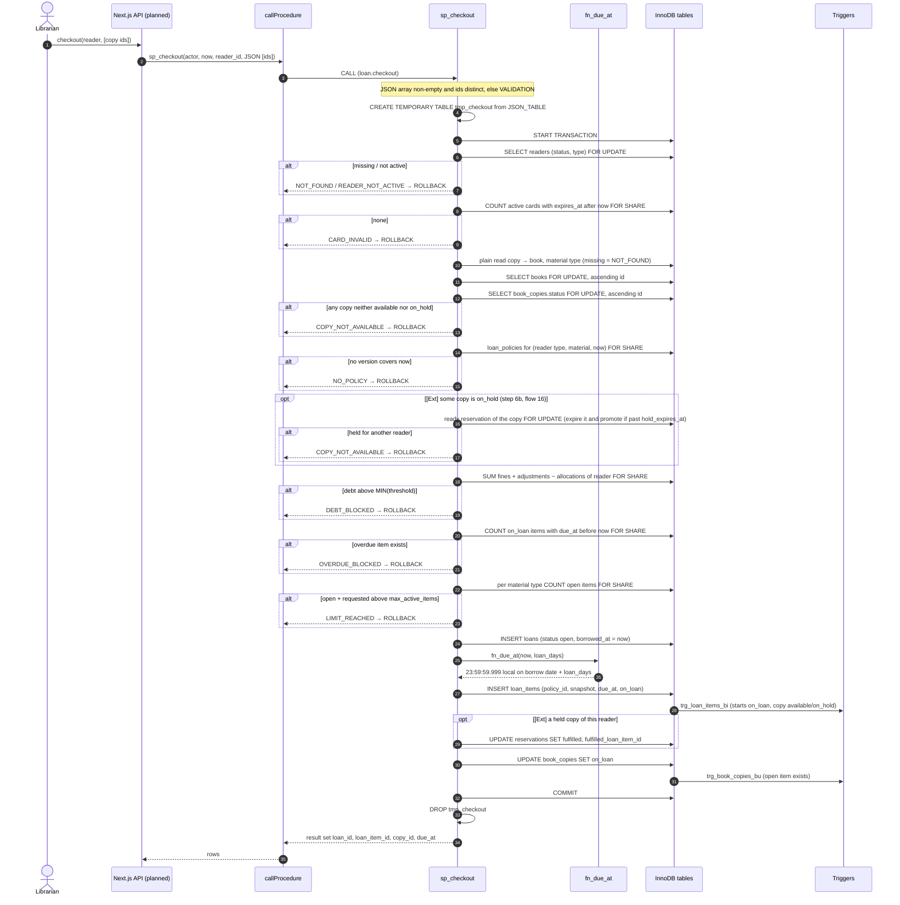
```mermaid
sequenceDiagram
    autonumber
    actor Librarian
    participant App as Next.js API (planned)
    participant CP as callProcedure
    participant SP as sp_checkout
    participant FN as fn_due_at
    participant DB as InnoDB tables
    participant TRG as Triggers

    Librarian->>App: checkout(reader, [copy ids])
    App->>CP: sp_checkout(actor, now, reader_id, JSON [ids])
    CP->>SP: CALL (loan.checkout)
    Note over SP: JSON array non-empty and ids distinct, else VALIDATION
    SP->>SP: CREATE TEMPORARY TABLE tmp_checkout from JSON_TABLE
    SP->>DB: START TRANSACTION
    SP->>DB: SELECT readers (status, type) FOR UPDATE
    alt missing / not active
        SP-->>CP: NOT_FOUND / READER_NOT_ACTIVE → ROLLBACK
    end
    SP->>DB: COUNT active cards with expires_at after now FOR SHARE
    alt none
        SP-->>CP: CARD_INVALID → ROLLBACK
    end
    SP->>DB: plain read copy → book, material type (missing = NOT_FOUND)
    SP->>DB: SELECT books FOR UPDATE, ascending id
    SP->>DB: SELECT book_copies.status FOR UPDATE, ascending id
    alt any copy neither available nor on_hold
        SP-->>CP: COPY_NOT_AVAILABLE → ROLLBACK
    end
    SP->>DB: loan_policies for (reader type, material, now) FOR SHARE
    alt no version covers now
        SP-->>CP: NO_POLICY → ROLLBACK
    end
    opt [Ext] some copy is on_hold (step 6b, flow 16)
        SP->>DB: ready reservation of the copy FOR UPDATE (expire it and promote if past hold_expires_at)
        alt held for another reader
            SP-->>CP: COPY_NOT_AVAILABLE → ROLLBACK
        end
    end
    SP->>DB: SUM fines + adjustments − allocations of reader FOR SHARE
    alt debt above MIN(threshold)
        SP-->>CP: DEBT_BLOCKED → ROLLBACK
    end
    SP->>DB: COUNT on_loan items with due_at before now FOR SHARE
    alt overdue item exists
        SP-->>CP: OVERDUE_BLOCKED → ROLLBACK
    end
    SP->>DB: per material type COUNT open items FOR SHARE
    alt open + requested above max_active_items
        SP-->>CP: LIMIT_REACHED → ROLLBACK
    end
    SP->>DB: INSERT loans (status open, borrowed_at = now)
    SP->>FN: fn_due_at(now, loan_days)
    FN-->>SP: 23:59:59.999 local on borrow date + loan_days
    SP->>DB: INSERT loan_items (policy_id, snapshot, due_at, on_loan)
    DB->>TRG: trg_loan_items_bi (starts on_loan, copy available/on_hold)
    opt [Ext] a held copy of this reader
        SP->>DB: UPDATE reservations SET fulfilled, fulfilled_loan_item_id
    end
    SP->>DB: UPDATE book_copies SET on_loan
    DB->>TRG: trg_book_copies_bu (open item exists)
    SP->>DB: COMMIT
    SP->>SP: DROP tmp_checkout
    SP-->>CP: result set loan_id, loan_item_id, copy_id, due_at
    CP-->>App: rows
```

- Checkout locks rows in this order: reader → cards (S) → books ↑ → copies ↑ → policy (S) → [Ext] reservations of held copies → the reader's loans, items and fines (S, for the eligibility sums). The debt check never uses `fn_reader_outstanding`.
- Eligibility rules (FR-009d): the reader is `active`, the card is valid at `p_now`, the debt is at or below the threshold (the strictest threshold among the requested material types), there is no overdue item (D7), the limit holds for each material type, and each copy is `available`, or `on_hold` for this reader.
- A copy can have only one open loan item, guaranteed by `UNIQUE(open_copy_id)` (FR-012). The snapshot fields `applied_*` never change afterwards (`trg_loan_items_bu`, `SNAPSHOT_IMMUTABLE`).
- The procedure is all-or-nothing (D13): any failure rolls back every item and drops the temporary table.
- [Ext] Held copies (flow 16): checkout expires an overdue hold on a scanned copy and promotes the queue, then accepts an `on_hold` copy only when this reader is the holder. The holder's reservation becomes `fulfilled` with the new loan item.
- Error keys: `FORBIDDEN`, `VALIDATION`, `NOT_FOUND`, `READER_NOT_ACTIVE`, `CARD_INVALID`, `COPY_NOT_AVAILABLE`, `NO_POLICY`, `DEBT_BLOCKED`, `OVERDUE_BLOCKED`, `LIMIT_REACHED`, `COPY_STATE`.

### 6. Return an item

`sp_return_item` closes one loan item as `returned`. It calls the internal helper `sp__assess_fines` inside the same transaction. If the item comes back damaged, the copy goes to `in_repair`; otherwise it becomes available and `sp__promote_queue` gives it to the first eligible waiting reader (flow 15). The loan closes when its last open item is returned.

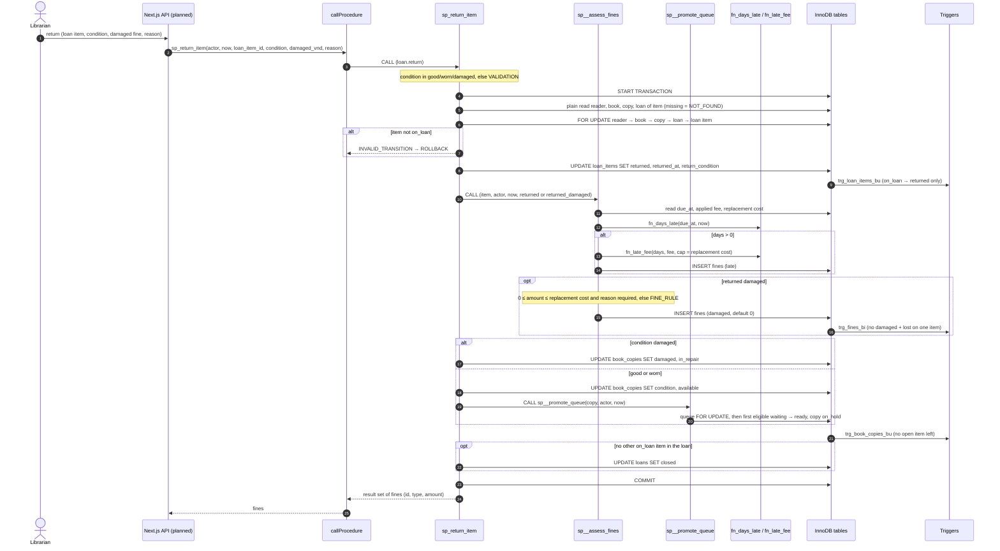
```mermaid
sequenceDiagram
    autonumber
    actor Librarian
    participant App as Next.js API (planned)
    participant CP as callProcedure
    participant SP as sp_return_item
    participant AF as sp__assess_fines
    participant PQ as sp__promote_queue
    participant FN as fn_days_late / fn_late_fee
    participant DB as InnoDB tables
    participant TRG as Triggers

    Librarian->>App: return (loan item, condition, damaged fine, reason)
    App->>CP: sp_return_item(actor, now, loan_item_id, condition, damaged_vnd, reason)
    CP->>SP: CALL (loan.return)
    Note over SP: condition in good/worn/damaged, else VALIDATION
    SP->>DB: START TRANSACTION
    SP->>DB: plain read reader, book, copy, loan of item (missing = NOT_FOUND)
    SP->>DB: FOR UPDATE reader → book → copy → loan → loan item
    alt item not on_loan
        SP-->>CP: INVALID_TRANSITION → ROLLBACK
    end
    SP->>DB: UPDATE loan_items SET returned, returned_at, return_condition
    DB->>TRG: trg_loan_items_bu (on_loan → returned only)
    SP->>AF: CALL (item, actor, now, returned or returned_damaged)
    AF->>DB: read due_at, applied fee, replacement cost
    AF->>FN: fn_days_late(due_at, now)
    alt days > 0
        AF->>FN: fn_late_fee(days, fee, cap = replacement cost)
        AF->>DB: INSERT fines (late)
    end
    opt returned damaged
        Note over AF: 0 ≤ amount ≤ replacement cost and reason required, else FINE_RULE
        AF->>DB: INSERT fines (damaged, default 0)
        DB->>TRG: trg_fines_bi (no damaged + lost on one item)
    end
    alt condition damaged
        SP->>DB: UPDATE book_copies SET damaged, in_repair
    else good or worn
        SP->>DB: UPDATE book_copies SET condition, available
        SP->>PQ: CALL sp__promote_queue(copy, actor, now)
        PQ->>DB: queue FOR UPDATE, then first eligible waiting → ready, copy on_hold
    end
    DB->>TRG: trg_book_copies_bu (no open item left)
    opt no other on_loan item in the loan
        SP->>DB: UPDATE loans SET closed
    end
    SP->>DB: COMMIT
    SP-->>CP: result set of fines (id, type, amount)
    CP-->>App: fines
```

- Days late are counted as local calendar days: `DATEDIFF(local(return), local(due))`, never below 0. The late fee is `days × applied_daily_fee_vnd`, capped at the book's replacement cost (D2).
- A loan item has at most one fine per type (`UNIQUE(loan_item_id, fine_type)`), and never both a damaged and a lost fine (`FINE_RULE`). Fines are append-only (`APPEND_ONLY`).
- A loan is `closed` exactly when none of its items is `on_loan` (I-4).
- [Ext] A good or worn return runs `sp__promote_queue` in the same transaction, after the loan item lock (the queue is last in the lock order). The copy is `on_hold` for the first eligible waiting reader, or stays `available` when nobody is waiting. A damaged return does not promote the queue.
- Error keys: `FORBIDDEN`, `VALIDATION`, `NOT_FOUND`, `INVALID_TRANSITION`, `FINE_RULE`, `COPY_STATE`.

### 7. Renew

`sp_renew` pushes the due time of one open item forward by the item's own `applied_loan_days` (D5). It records each renewal as a `loan_renewals` row in the same transaction. The rejection detail says why the renewal failed.

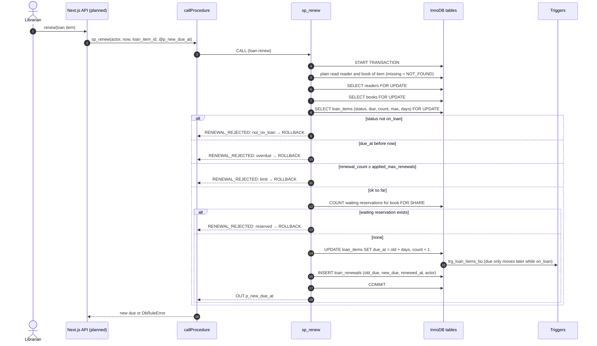
```mermaid
sequenceDiagram
    autonumber
    actor Librarian
    participant App as Next.js API (planned)
    participant CP as callProcedure
    participant SP as sp_renew
    participant DB as InnoDB tables
    participant TRG as Triggers

    Librarian->>App: renew(loan item)
    App->>CP: sp_renew(actor, now, loan_item_id, @p_new_due_at)
    CP->>SP: CALL (loan.renew)
    SP->>DB: START TRANSACTION
    SP->>DB: plain read reader and book of item (missing = NOT_FOUND)
    SP->>DB: SELECT readers FOR UPDATE
    SP->>DB: SELECT books FOR UPDATE
    SP->>DB: SELECT loan_items (status, due, count, max, days) FOR UPDATE
    alt status not on_loan
        SP-->>CP: RENEWAL_REJECTED: not_on_loan → ROLLBACK
    else due_at before now
        SP-->>CP: RENEWAL_REJECTED: overdue → ROLLBACK
    else renewal_count ≥ applied_max_renewals
        SP-->>CP: RENEWAL_REJECTED: limit → ROLLBACK
    else ok so far
        SP->>DB: COUNT waiting reservations for book FOR SHARE
        alt waiting reservation exists
            SP-->>CP: RENEWAL_REJECTED: reserved → ROLLBACK
        else none
            SP->>DB: UPDATE loan_items SET due_at = old + days, count + 1
            DB->>TRG: trg_loan_items_bu (due only moves later while on_loan)
            SP->>DB: INSERT loan_renewals (old_due, new_due, renewed_at, actor)
            SP->>DB: COMMIT
            SP-->>CP: OUT p_new_due_at
        end
    end
    CP-->>App: new due or DbRuleError
```

- Renewal locks rows in this order: reader → book → loan item → reservations (S). The CHECK constraints `new_due_at > old_due_at` and `renewal_count ≤ applied_max_renewals` back up the procedure.
- The `reserved` check counts the book's `waiting` reservations `FOR SHARE` after the book lock. `sp_reserve` also locks the book first, so a renewal and a new reservation serialize (CT-12). A `ready` hold on another copy does not block renewal.
- Error keys: `FORBIDDEN`, `NOT_FOUND`, `RENEWAL_REJECTED` (`not_on_loan` / `overdue` / `limit` / `reserved`), `SNAPSHOT_IMMUTABLE`.

### 8. Declare lost

`sp_declare_lost` takes the same locks as a return, but it ends the item as `lost`. It assesses the late fine up to `p_now` plus a lost fine, whose default is the book's replacement cost. The copy becomes `lost`. If the copy is found later, `sp_change_copy_status` (flow 2) can bring it back.

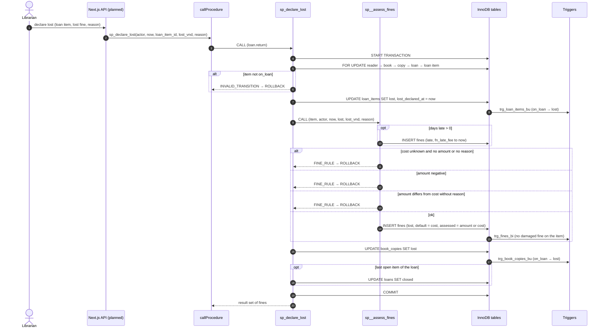
```mermaid
sequenceDiagram
    autonumber
    actor Librarian
    participant App as Next.js API (planned)
    participant CP as callProcedure
    participant SP as sp_declare_lost
    participant AF as sp__assess_fines
    participant DB as InnoDB tables
    participant TRG as Triggers

    Librarian->>App: declare lost (loan item, lost fine, reason)
    App->>CP: sp_declare_lost(actor, now, loan_item_id, lost_vnd, reason)
    CP->>SP: CALL (loan.return)
    SP->>DB: START TRANSACTION
    SP->>DB: FOR UPDATE reader → book → copy → loan → loan item
    alt item not on_loan
        SP-->>CP: INVALID_TRANSITION → ROLLBACK
    end
    SP->>DB: UPDATE loan_items SET lost, lost_declared_at = now
    DB->>TRG: trg_loan_items_bu (on_loan → lost)
    SP->>AF: CALL (item, actor, now, lost, lost_vnd, reason)
    opt days late > 0
        AF->>DB: INSERT fines (late, fn_late_fee to now)
    end
    alt cost unknown and no amount or no reason
        AF-->>SP: FINE_RULE → ROLLBACK
    else amount negative
        AF-->>SP: FINE_RULE → ROLLBACK
    else amount differs from cost without reason
        AF-->>SP: FINE_RULE → ROLLBACK
    else ok
        AF->>DB: INSERT fines (lost, default = cost, assessed = amount or cost)
        DB->>TRG: trg_fines_bi (no damaged fine on the item)
    end
    SP->>DB: UPDATE book_copies SET lost
    DB->>TRG: trg_book_copies_bu (on_loan → lost)
    opt last open item of the loan
        SP->>DB: UPDATE loans SET closed
    end
    SP->>DB: COMMIT
    SP-->>CP: result set of fines
```

- The loan item stays `lost` even if the copy is found later (both loan-item end states are terminal).
- `fines_reason_ck`: whenever the assessed amount differs from the default amount, a non-blank reason is required.
- CT-5: when a return and a lost declaration race on the same item, the lock on the loan item serializes them. The second one fails with `INVALID_TRANSITION`.
- Error keys: `FORBIDDEN`, `NOT_FOUND`, `INVALID_TRANSITION`, `FINE_RULE`.

### 9. Record a payment

`sp_record_payment` is the only way to write payments and allocations (FR-016a), because the app account has no INSERT on either table. Each call carries a request key. Repeating a key with the same reader, amount and allocations returns the existing payment and writes nothing; the same key with a different payload is rejected with `IDEMPOTENCY_CONFLICT`. The payment must be allocated in full to the reader's own fines, and the procedure re-checks that the stored allocations add up to the amount before `COMMIT`.

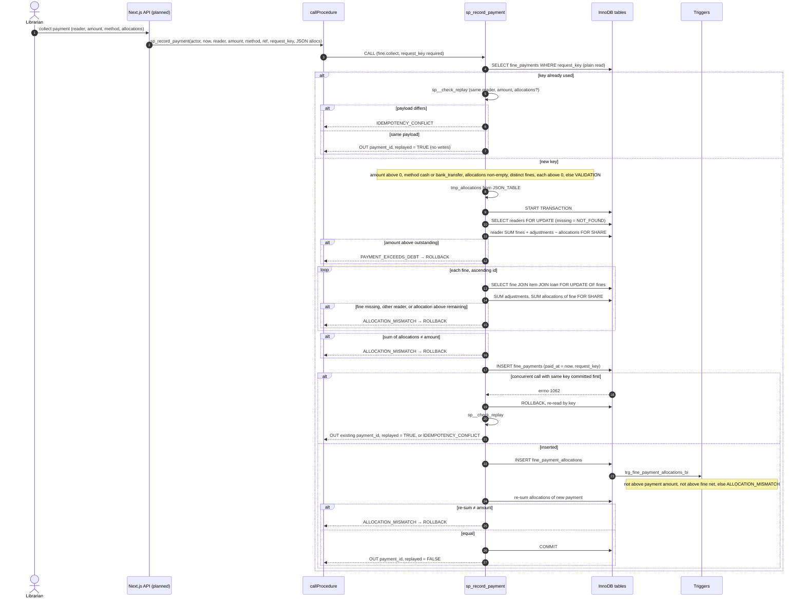
```mermaid
sequenceDiagram
    autonumber
    actor Librarian
    participant App as Next.js API (planned)
    participant CP as callProcedure
    participant SP as sp_record_payment
    participant DB as InnoDB tables
    participant TRG as Triggers

    Librarian->>App: collect payment (reader, amount, method, allocations)
    App->>CP: sp_record_payment(actor, now, reader, amount, method, ref, request_key, JSON allocs)
    CP->>SP: CALL (fine.collect, request_key required)
    SP->>DB: SELECT fine_payments WHERE request_key (plain read)
    alt key already used
        SP->>SP: sp__check_replay (same reader, amount, allocations?)
        alt payload differs
            SP-->>CP: IDEMPOTENCY_CONFLICT
        else same payload
            SP-->>CP: OUT payment_id, replayed = TRUE (no writes)
        end
    else new key
        Note over SP: amount above 0, method cash or bank_transfer, allocations non-empty, distinct fines, each above 0, else VALIDATION
        SP->>SP: tmp_allocations from JSON_TABLE
        SP->>DB: START TRANSACTION
        SP->>DB: SELECT readers FOR UPDATE (missing = NOT_FOUND)
        SP->>DB: reader SUM fines + adjustments − allocations FOR SHARE
        alt amount above outstanding
            SP-->>CP: PAYMENT_EXCEEDS_DEBT → ROLLBACK
        end
        loop each fine, ascending id
            SP->>DB: SELECT fine JOIN item JOIN loan FOR UPDATE OF fines
            SP->>DB: SUM adjustments, SUM allocations of fine FOR SHARE
            alt fine missing, other reader, or allocation above remaining
                SP-->>CP: ALLOCATION_MISMATCH → ROLLBACK
            end
        end
        alt sum of allocations ≠ amount
            SP-->>CP: ALLOCATION_MISMATCH → ROLLBACK
        end
        SP->>DB: INSERT fine_payments (paid_at = now, request_key)
        alt concurrent call with same key committed first
            DB-->>SP: errno 1062
            SP->>DB: ROLLBACK, re-read by key
            SP->>SP: sp__check_replay
            SP-->>CP: OUT existing payment_id, replayed = TRUE, or IDEMPOTENCY_CONFLICT
        else inserted
            SP->>DB: INSERT fine_payment_allocations
            DB->>TRG: trg_fine_payment_allocations_bi
            Note over TRG: not above payment amount, not above fine net, else ALLOCATION_MISMATCH
            SP->>DB: re-sum allocations of new payment
            alt re-sum ≠ amount
                SP-->>CP: ALLOCATION_MISMATCH → ROLLBACK
            else equal
                SP->>DB: COMMIT
                SP-->>CP: OUT payment_id, replayed = FALSE
            end
        end
    end
```

- Payment locks rows in this order: reader → the reader's fines (S, for the debt sum) → listed fines `FOR UPDATE OF f` in ascending id → their adjustment and allocation sums (S).
- Rules: Σ allocations = amount (FR-016), each allocation is above 0, no allocation exceeds the fine's remaining balance, and the payment never exceeds the reader's outstanding debt. The app account can always keep these rules. Privileged accounts can bypass them, so `v_inv_payment_allocation` (I-6) checks afterwards.
- Payments and allocations are append-only: the `trg_fine_payment*_bu/bd` triggers raise `APPEND_ONLY`.
- Error keys: `FORBIDDEN`, `VALIDATION`, `NOT_FOUND`, `IDEMPOTENCY_CONFLICT`, `PAYMENT_EXCEEDS_DEBT`, `ALLOCATION_MISMATCH`, `APPEND_ONLY`.

### 10. Adjust a fine

Corrections are never edits to a fine. They are signed, reasoned rows in `fine_adjustments`, written only by `sp_adjust_fine`. After the adjustment, the fine's net amount must stay at or above what has already been paid, and must not go negative.

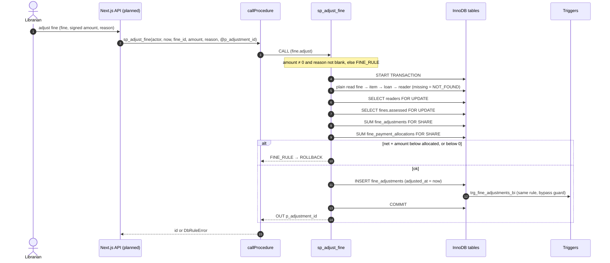
```mermaid
sequenceDiagram
    autonumber
    actor Librarian
    participant App as Next.js API (planned)
    participant CP as callProcedure
    participant SP as sp_adjust_fine
    participant DB as InnoDB tables
    participant TRG as Triggers

    Librarian->>App: adjust fine (fine, signed amount, reason)
    App->>CP: sp_adjust_fine(actor, now, fine_id, amount, reason, @p_adjustment_id)
    CP->>SP: CALL (fine.adjust)
    Note over SP: amount ≠ 0 and reason not blank, else FINE_RULE
    SP->>DB: START TRANSACTION
    SP->>DB: plain read fine → item → loan → reader (missing = NOT_FOUND)
    SP->>DB: SELECT readers FOR UPDATE
    SP->>DB: SELECT fines.assessed FOR UPDATE
    SP->>DB: SUM fine_adjustments FOR SHARE
    SP->>DB: SUM fine_payment_allocations FOR SHARE
    alt net + amount below allocated, or below 0
        SP-->>CP: FINE_RULE → ROLLBACK
    else ok
        SP->>DB: INSERT fine_adjustments (adjusted_at = now)
        DB->>TRG: trg_fine_adjustments_bi (same rule, bypass guard)
        SP->>DB: COMMIT
        SP-->>CP: OUT p_adjustment_id
    end
    CP-->>App: id or DbRuleError
```

- Net amount = assessed + Σ adjustments. The rule is net ≥ Σ allocations ≥ 0 (FR-017), and I-5 (`v_inv_fine_balance`) reports any break.
- Adjustments are append-only (`trg_fine_adjustments_bu/bd`), with CHECK constraints `amount ≠ 0` and a non-blank reason.
- CT-13: a payment and an adjustment on the same fine serialize on the reader lock and then the fine lock.
- Error keys: `FORBIDDEN`, `NOT_FOUND`, `FINE_RULE`, `APPEND_ONLY`.

### 11. Expire cards (batch)

`sp_expire_cards` is a cursor batch that sets every past-expiry `active` card to `expired`. Each card gets its own short transaction, so the batch never holds many locks at once. Under the reader lock it checks the card again, because the card may have changed after the cursor read it.

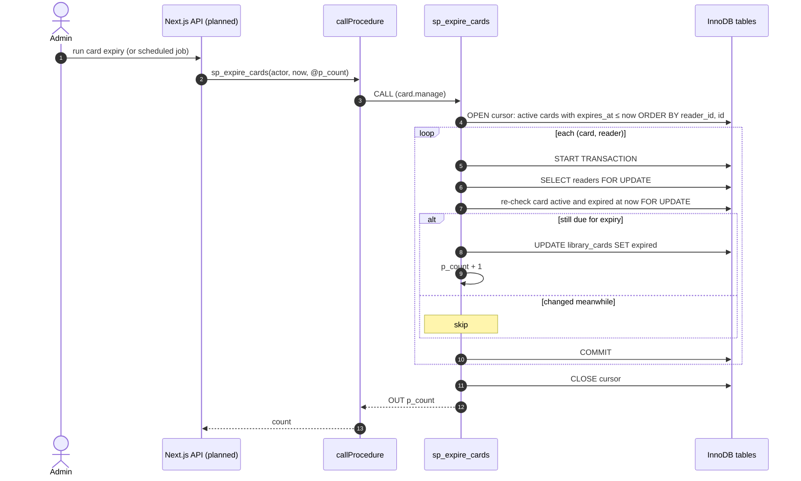
```mermaid
sequenceDiagram
    autonumber
    actor Admin
    participant App as Next.js API (planned)
    participant CP as callProcedure
    participant SP as sp_expire_cards
    participant DB as InnoDB tables

    Admin->>App: run card expiry (or scheduled job)
    App->>CP: sp_expire_cards(actor, now, @p_count)
    CP->>SP: CALL (card.manage)
    SP->>DB: OPEN cursor: active cards with expires_at ≤ now ORDER BY reader_id, id
    loop each (card, reader)
        SP->>DB: START TRANSACTION
        SP->>DB: SELECT readers FOR UPDATE
        SP->>DB: re-check card active and expired at now FOR UPDATE
        alt still due for expiry
            SP->>DB: UPDATE library_cards SET expired
            SP->>SP: p_count + 1
        else changed meanwhile
            Note over SP: skip
        end
        SP->>DB: COMMIT
    end
    SP->>DB: CLOSE cursor
    SP-->>CP: OUT p_count
    CP-->>App: count
```

- Each card is committed on its own. If an error occurs partway, the handler rolls back only the current card and re-raises. Cards already committed stay expired, and the caller can simply run the batch again.
- Lock order per card: reader → card.
- Error keys: `FORBIDDEN`, plus 1213/1205 retried by the caller.

### 12. Reports and the invariant check

The debt reports are read-only procedures with no locks and no permission check, and each returns one result set. They count every record at its own time: fines at `assessed_at`, adjustments at `adjusted_at`, payments at `paid_at`. The circulation reports are plain `v_report_*` views. `pnpm db:check` queries every `v_inv_*` view, and the database is correct only if each one returns zero rows.

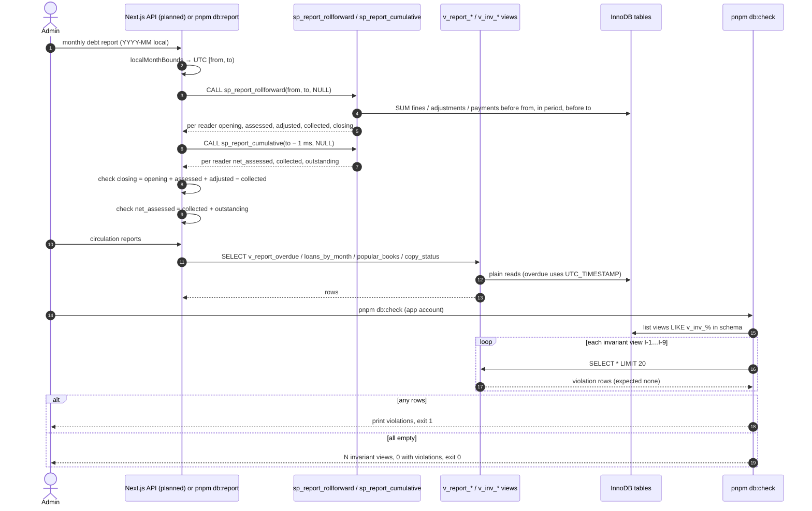
```mermaid
sequenceDiagram
    autonumber
    actor Admin
    participant App as Next.js API (planned) or pnpm db:report
    participant SP as sp_report_rollforward / sp_report_cumulative
    participant V as v_report_* / v_inv_* views
    participant DB as InnoDB tables
    participant CHK as pnpm db:check

    Admin->>App: monthly debt report (YYYY-MM local)
    App->>App: localMonthBounds → UTC [from, to)
    App->>SP: CALL sp_report_rollforward(from, to, NULL)
    SP->>DB: SUM fines / adjustments / payments before from, in period, before to
    SP-->>App: per reader opening, assessed, adjusted, collected, closing
    App->>SP: CALL sp_report_cumulative(to − 1 ms, NULL)
    SP-->>App: per reader net_assessed, collected, outstanding
    App->>App: check closing = opening + assessed + adjusted − collected
    App->>App: check net_assessed = collected + outstanding
    Admin->>App: circulation reports
    App->>V: SELECT v_report_overdue / loans_by_month / popular_books / copy_status
    V->>DB: plain reads (overdue uses UTC_TIMESTAMP)
    V-->>App: rows

    Admin->>CHK: pnpm db:check (app account)
    CHK->>DB: list views LIKE v_inv_% in schema
    loop each invariant view I-1…I-9
        CHK->>V: SELECT * LIMIT 20
        V-->>CHK: violation rows (expected none)
    end
    alt any rows
        CHK-->>Admin: print violations, exit 1
    else all empty
        CHK-->>Admin: N invariant views, 0 with violations, exit 0
    end
```

- Roll-forward identity: `closing = opening + assessed + adjusted − collected`. Cumulative identity: `net_assessed = collected + outstanding` (SC-006). `pnpm db:report` checks both.
- The invariant views are: `v_inv_copy_on_loan` (I-1), `v_inv_copy_on_hold` (I-2), `v_inv_queue_available` (I-3), `v_inv_loan_status` (I-4), `v_inv_fine_balance` (I-5), `v_inv_payment_allocation` (I-6), `v_inv_damaged_lendable` (I-7), `v_inv_cards_policies` (I-8) and `v_inv_borrow_in_policy` (I-9).
- `fn_fine_net`, `fn_fine_remaining` and `fn_reader_outstanding` use plain reads. They serve reports and views only and never decide a write.

### 13. Developer pipeline

Every step reads its settings from `.env.local`: `DB_HOST`, `DB_PORT`, `DB_NAME`, `DB_USER`, `DB_PASSWORD` and `MYSQL_ROOT_PASSWORD`. Migrations and grants run as the owner (`root`). Seeding runs as the restricted app account and goes through the same procedures the app will use. A backup is restored into a separate schema and has to pass the invariant suite.

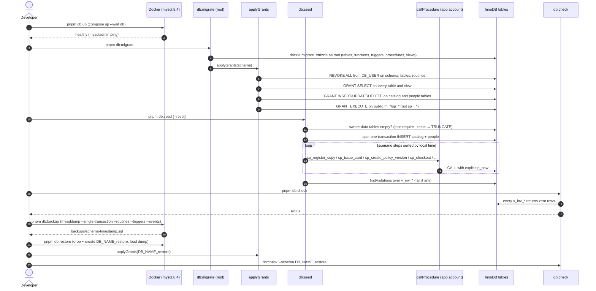
```mermaid
sequenceDiagram
    autonumber
    actor Dev as Developer
    participant DK as Docker (mysql:8.4)
    participant MG as db:migrate (root)
    participant GR as applyGrants
    participant SD as db:seed
    participant CP as callProcedure (app account)
    participant DB as InnoDB tables
    participant CHK as db:check

    Dev->>DK: pnpm db:up (compose up --wait db)
    DK-->>Dev: healthy (mysqladmin ping)
    Dev->>MG: pnpm db:migrate
    MG->>DB: drizzle migrate ./drizzle as root (tables, functions, triggers, procedures, views)
    MG->>GR: applyGrants(schema)
    GR->>DB: REVOKE ALL from DB_USER on schema, tables, routines
    GR->>DB: GRANT SELECT on every table and view
    GR->>DB: GRANT INSERT/UPDATE/DELETE on catalog and people tables
    GR->>DB: GRANT EXECUTE on public fn_*/sp_* (not sp__*)
    Dev->>SD: pnpm db:seed [--reset]
    SD->>DB: owner: data tables empty? (else require --reset → TRUNCATE)
    SD->>DB: app: one transaction INSERT catalog + people
    loop scenario steps sorted by local time
        SD->>CP: sp_register_copy / sp_issue_card / sp_create_policy_version / sp_checkout / …
        CP->>DB: CALL with explicit p_now
    end
    SD->>DB: findViolations over v_inv_* (fail if any)
    Dev->>CHK: pnpm db:check
    CHK->>DB: every v_inv_* returns zero rows
    CHK-->>Dev: exit 0

    Dev->>DK: pnpm db:backup (mysqldump --single-transaction --routines --triggers --events)
    DK-->>Dev: backups/schema-timestamp.sql
    Dev->>DK: pnpm db:restore (drop + create DB_NAME_restore, load dump)
    Dev->>GR: applyGrants(DB_NAME_restore)
    Dev->>CHK: db:check --schema DB_NAME_restore
```

- Environment variables must stay minimal and unprefixed (FR-030). The test schema is always derived as `${DB_NAME}_test` (`pnpm db:reset-test` drops it, re-creates it and migrates it). No migration names an account.
- The seed may insert only catalog and people data directly (FR-025b). Copies, cards, policies, loans, fines and payments all go through the procedures, with explicit times.
- Seeding runs only on an empty schema, or after `--reset` (FR-025a). Reference tables (`material_types`, `reader_types`, roles, permissions) come from migrations and are never truncated.
- `mysql`/`mysqldump` run inside the container, and the password is passed in `MYSQL_PWD`, never on the command line.

### Reservations and holds (Ext, flows 14–18)

Reservations are built as an extension on top of the Core circulation (migrations `ext_reservation_trigger`, `ext_promote_queue`, `ext_reservation_procedures`, `ext_hold_expiry_event`). The public procedures are `sp_reserve`, `sp_cancel_reservation` and `sp_expire_holds`. The internal helpers `sp__promote_queue` and `sp__expire_holds_batch` are not granted to the app account. The event `ev_expire_holds` runs the expiry batch every 15 minutes. The Core procedures `sp_register_copy`, `sp_change_copy_status`, `sp_return_item` and `sp_checkout` were re-created so that they promote the queue or accept holds.

These rules apply to every flow below:

- **Book-lock serialization.** Every writer of a book's reservations or copy statuses (reserve, cancel, promotion through return, register, repair done or found, checkout, renew, hold expiry) locks the `books` row first. So two such operations on the same book always run one after the other. Reading a reservation `FOR UPDATE` right after the book lock is safe, and CT-10…CT-12 cannot interleave inside one book.
- **Lock order.** The order is reader → book → copy → (policy, in checkout) → reservations. Within one book, the queue is locked in `(requested_at, id)` order through `reservations_queue_ix`.
- **Status guard.** `trg_reservations_bu` allows only `waiting → ready | cancelled` and `ready → fulfilled | expired | cancelled`. It also rejects any change of `reader_id` or `book_id`. Any other change raises `INVALID_TRANSITION`.
- **Single-row rules.** At most one `waiting`/`ready` reservation per (reader, book) (`reservations_active_uq` on `active_flag`). At most one `ready` hold per copy (`reservations_ready_copy_uq` on `ready_copy_id`). A reservation is fulfilled by at most one loan item (`reservations_fulfilled_item_uq`). A `ready` row needs `assigned_copy_id`, `ready_at` and `hold_expires_at > ready_at` (`reservations_ready_ck`).
- **Invariants.** I-2 (`v_inv_copy_on_hold`: a copy is `on_hold` exactly when one `ready` reservation holds it) and I-3 (`v_inv_queue_available`: no book has both a `waiting` reservation and an `available` copy) must stay empty. Tests: `tests/db/us3-reservations.test.ts` and CT-9…CT-12.

### 14. Reserve

`sp_reserve` puts a reader in a book's queue as `waiting`. This is allowed only when no copy of the book is `available` and the reader has no copy of it `on_loan` (D6, FR-014a). Staff with `reservation.manage` can reserve for any reader. A reader's own active account can reserve only for itself.

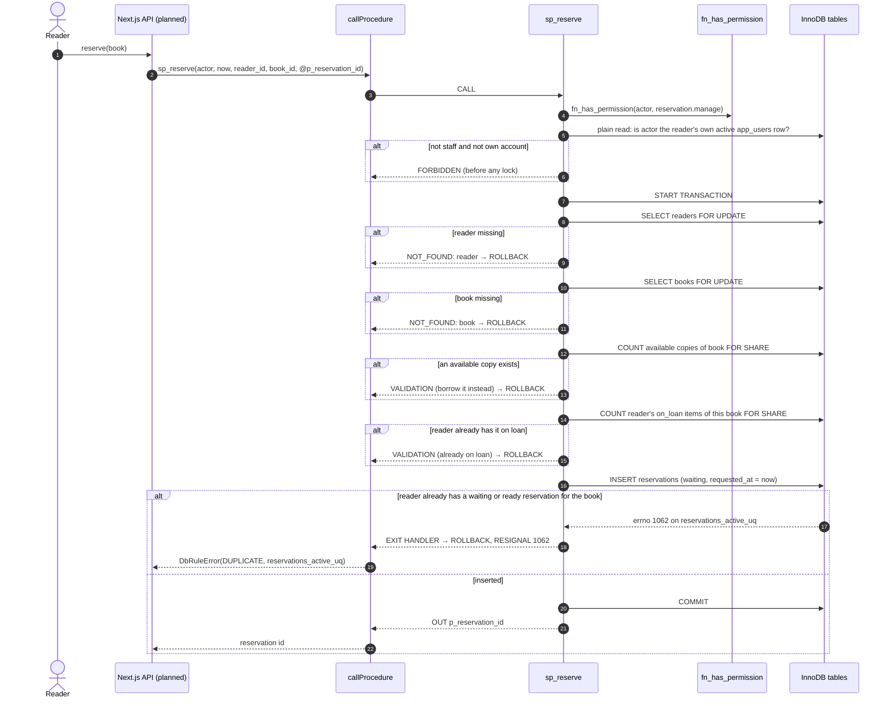
```mermaid
sequenceDiagram
    autonumber
    actor Reader
    participant App as Next.js API (planned)
    participant CP as callProcedure
    participant SP as sp_reserve
    participant FN as fn_has_permission
    participant DB as InnoDB tables

    Reader->>App: reserve(book)
    App->>CP: sp_reserve(actor, now, reader_id, book_id, @p_reservation_id)
    CP->>SP: CALL
    SP->>FN: fn_has_permission(actor, reservation.manage)
    SP->>DB: plain read: is actor the reader's own active app_users row?
    alt not staff and not own account
        SP-->>CP: FORBIDDEN (before any lock)
    end
    SP->>DB: START TRANSACTION
    SP->>DB: SELECT readers FOR UPDATE
    alt reader missing
        SP-->>CP: NOT_FOUND: reader → ROLLBACK
    end
    SP->>DB: SELECT books FOR UPDATE
    alt book missing
        SP-->>CP: NOT_FOUND: book → ROLLBACK
    end
    SP->>DB: COUNT available copies of book FOR SHARE
    alt an available copy exists
        SP-->>CP: VALIDATION (borrow it instead) → ROLLBACK
    end
    SP->>DB: COUNT reader's on_loan items of this book FOR SHARE
    alt reader already has it on loan
        SP-->>CP: VALIDATION (already on loan) → ROLLBACK
    end
    SP->>DB: INSERT reservations (waiting, requested_at = now)
    alt reader already has a waiting or ready reservation for the book
        DB-->>SP: errno 1062 on reservations_active_uq
        SP-->>CP: EXIT HANDLER → ROLLBACK, RESIGNAL 1062
        CP-->>App: DbRuleError(DUPLICATE, reservations_active_uq)
    else inserted
        SP->>DB: COMMIT
        SP-->>CP: OUT p_reservation_id
        CP-->>App: reservation id
    end
```

- Locks: reader → book → the book's copies (S) → the reader's loan items of the book (S). The `available` count cannot change underneath, because every procedure that makes a copy of this book `available` holds the book lock (CT-11: a return and a reserve on the same book serialize; either the reservation is in the queue before the return promotes it, or the reserve sees the copy and is rejected).
- `VALIDATION` covers both D6 preconditions: the book has an `available` copy, or the reader has it `on_loan`. Copies that are `on_hold` for someone else, `in_repair`, `lost` or `retired` do not stop a reservation.
- `DUPLICATE` has no explicit check. The unique index `reservations_active_uq` raises 1062, and `callProcedure` reports it as `DUPLICATE` with the index name as detail (R-14a).
- `FORBIDDEN` is raised when the actor lacks `reservation.manage` and is not the reader's own active account. `NOT_FOUND` is raised for a missing reader or book.
- The reader's status and card are **not** checked here. A hard-ineligible reader can join the queue, and promotion cancels them later (flow 15).
- Error keys: `FORBIDDEN`, `NOT_FOUND`, `VALIDATION`, `DUPLICATE`.

### 15. Queue promotion (on return)

`sp__promote_queue(copy, actor, now)` gives a lendable copy to the first eligible `waiting` reservation of its book. If nobody is eligible, it makes the copy `available`. It always runs inside the caller's transaction, and the caller already holds the book and copy locks. The callers are:

- `sp_return_item` for a good or worn return;
- `sp_register_copy` for a new copy that is not damaged;
- `sp_change_copy_status` when the target is `available` (repair done, found);
- `sp_cancel_reservation` when a `ready` hold is cancelled;
- `sp__expire_holds_batch` and `sp_checkout` step 6b after a hold expires.

The diagram shows the return case.

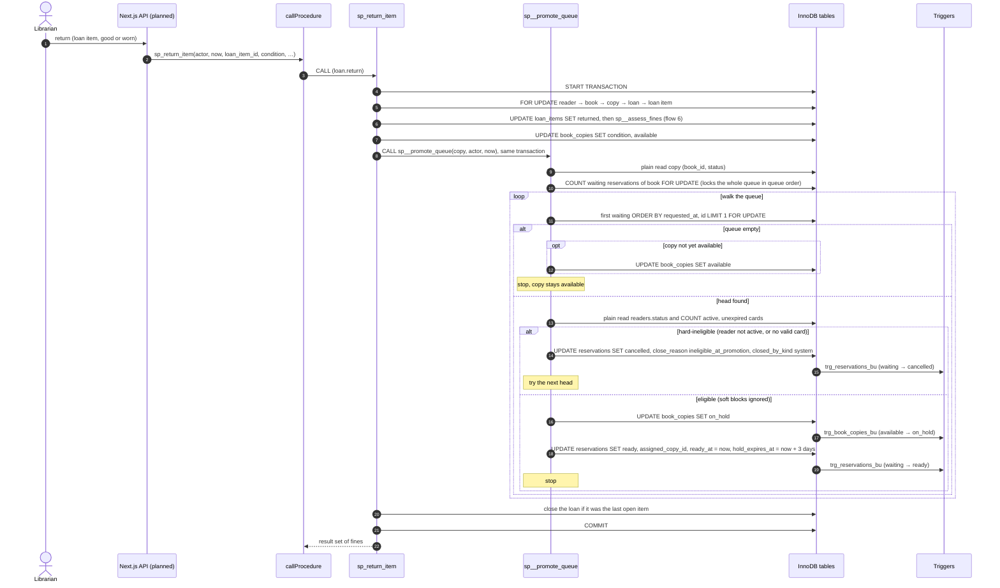
```mermaid
sequenceDiagram
    autonumber
    actor Librarian
    participant App as Next.js API (planned)
    participant CP as callProcedure
    participant SP as sp_return_item
    participant PQ as sp__promote_queue
    participant DB as InnoDB tables
    participant TRG as Triggers

    Librarian->>App: return (loan item, good or worn)
    App->>CP: sp_return_item(actor, now, loan_item_id, condition, …)
    CP->>SP: CALL (loan.return)
    SP->>DB: START TRANSACTION
    SP->>DB: FOR UPDATE reader → book → copy → loan → loan item
    SP->>DB: UPDATE loan_items SET returned, then sp__assess_fines (flow 6)
    SP->>DB: UPDATE book_copies SET condition, available
    SP->>PQ: CALL sp__promote_queue(copy, actor, now), same transaction
    PQ->>DB: plain read copy (book_id, status)
    PQ->>DB: COUNT waiting reservations of book FOR UPDATE (locks the whole queue in queue order)
    loop walk the queue
        PQ->>DB: first waiting ORDER BY requested_at, id LIMIT 1 FOR UPDATE
        alt queue empty
            opt copy not yet available
                PQ->>DB: UPDATE book_copies SET available
            end
            Note over PQ: stop, copy stays available
        else head found
            PQ->>DB: plain read readers.status and COUNT active, unexpired cards
            alt hard-ineligible (reader not active, or no valid card)
                PQ->>DB: UPDATE reservations SET cancelled, close_reason ineligible_at_promotion, closed_by_kind system
                DB->>TRG: trg_reservations_bu (waiting → cancelled)
                Note over PQ: try the next head
            else eligible (soft blocks ignored)
                PQ->>DB: UPDATE book_copies SET on_hold
                DB->>TRG: trg_book_copies_bu (available → on_hold)
                PQ->>DB: UPDATE reservations SET ready, assigned_copy_id, ready_at = now, hold_expires_at = now + 3 days
                DB->>TRG: trg_reservations_bu (waiting → ready)
                Note over PQ: stop
            end
        end
    end
    SP->>DB: close the loan if it was the last open item
    SP->>DB: COMMIT
    SP-->>CP: result set of fines
```

- **Hard and soft ineligibility (D4).** Hard-ineligible readers are cancelled and skipped. A reader is hard-ineligible when their status is not `active` or they have no card that is `active` with `expires_at > now`. Soft blocks (debt above the threshold, an overdue item, the item limit) are ignored here. A soft-blocked reader still gets the hold, and it expires if they do not clear the block and collect within the window (FR-014d, US3-15).
- **Plain-read eligibility.** Reader status and cards are read without locks. Readers and cards come before books in the global lock order, so locking them here, after the book, would invert the order. Checkout re-checks the holder under its own locks. So a stale answer can only give a hold that later expires, never a loan.
- The hold window is 3 days (`hold_expires_at = now + INTERVAL 3 DAY`, D4). The copy is `on_hold` while a hold exists, and `available` only when the queue is empty (I-2, I-3).
- A copy already `on_hold` (after a cancel or an expiry) stays `on_hold` when the next reader gets it. It becomes `available` only when the queue is empty.
- A damaged return goes to `in_repair` and does not promote the queue. The queue waits for repair done (`sp_change_copy_status` → promotion).
- `NOT FOUND` from the helper's own `SELECT … INTO` is caught locally, so it never reaches a caller's cursor handler.

### 16. Checkout of a held copy

`sp_checkout` accepts an `on_hold` copy only for its holder (R-14f). In step 6b, which runs after the policy lock, it first expires an overdue hold on a scanned copy and runs the promotion. This is the "on demand when scanned" expiry of FR-014c. Then it decides who may take the copy. The other steps are the same as in flow 5.

```mermaid
sequenceDiagram
    autonumber
    actor Librarian
    participant App as Next.js API (planned)
    participant CP as callProcedure
    participant SP as sp_checkout
    participant PQ as sp__promote_queue
    participant DB as InnoDB tables
    participant TRG as Triggers

    Librarian->>App: checkout(reader, [copy ids]) incl. a copy from the hold shelf
    App->>CP: sp_checkout(actor, now, reader_id, JSON [ids])
    CP->>SP: CALL (loan.checkout)
    SP->>DB: steps 1–4 as flow 5: reader FOR UPDATE, cards FOR SHARE, books FOR UPDATE ↑
    SP->>DB: step 5: SELECT book_copies.status FOR UPDATE ↑
    alt status on_hold
        SP->>SP: mark tmp_checkout.on_hold = 1
    else status not available
        SP-->>CP: COPY_NOT_AVAILABLE → ROLLBACK
    end
    SP->>DB: step 6: loan_policies FOR SHARE (NO_POLICY)
    loop step 6b: each held copy, ascending id
        SP->>DB: SELECT reservations WHERE ready_copy_id = copy FOR UPDATE
        opt hold_expires_at ≤ now (on-demand expiry)
            SP->>DB: UPDATE reservations SET expired, close_reason hold_expired, closed_by_kind system
            DB->>TRG: trg_reservations_bu (ready → expired)
            SP->>PQ: CALL sp__promote_queue(copy, actor, now)
            PQ->>DB: next eligible waiting → ready (copy stays on_hold), or copy → available
            SP->>DB: re-read reservations WHERE ready_copy_id = copy FOR UPDATE
        end
        alt copy is held for another reader
            SP-->>CP: COPY_NOT_AVAILABLE (held for another reader) → ROLLBACK
        else this reader is the holder
            SP->>SP: tmp_checkout.reservation_id = reservation
        else no hold left
            Note over SP: the copy is lent as an ordinary available copy
        end
    end
    SP->>DB: steps 7–9 as flow 5 (DEBT_BLOCKED, OVERDUE_BLOCKED, LIMIT_REACHED)
    SP->>DB: INSERT loans, loan_items (snapshot, due_at)
    SP->>DB: UPDATE reservations SET fulfilled, fulfilled_loan_item_id, closed_by_kind staff, closed_by_user_id = actor
    DB->>TRG: trg_reservations_bu (ready → fulfilled)
    SP->>DB: UPDATE book_copies SET on_loan
    DB->>TRG: trg_book_copies_bu (on_hold → on_loan, open item exists)
    SP->>DB: COMMIT
    SP-->>CP: result set loan_id, loan_item_id, copy_id, due_at
```

- Lock order: reader → cards (S) → books ↑ → copies ↑ → policy (S) → reservation (and the queue, when the promotion runs) → the reader's loans, items and fines (S).
- `COPY_NOT_AVAILABLE` is raised for a copy that is neither `available` nor `on_hold`, and for an `on_hold` copy whose hold belongs to another reader, including a hold that just passed to the next reader in the queue (a walk-in never gets an expired hold's copy while someone is waiting).
- The holder still has to pass every eligibility check. A soft-blocked holder gets `DEBT_BLOCKED`, `OVERDUE_BLOCKED` or `LIMIT_REACHED` and keeps the hold until it expires. On any failure the whole call rolls back, including an on-demand expiry done in step 6b. In that case the batch (flow 18) expires the hold later.
- The reservation is closed as `fulfilled` with `fulfilled_loan_item_id` and `closed_by_kind = 'staff'`. This happens before the copy leaves `on_hold`, so I-2 holds at commit. CT-9 races the holder's checkout against the expiry batch: the result is exactly one of fulfilled or expired, never both.
- Error keys: as flow 5, plus `INVALID_TRANSITION` from the reservation trigger.

### 17. Cancel a reservation

`sp_cancel_reservation` closes a `waiting` or `ready` reservation. Staff (`reservation.manage`) must give a reason. The reader's own account may cancel without one. Cancelling a `ready` hold passes the copy to the queue.

```mermaid
sequenceDiagram
    autonumber
    actor Reader
    participant App as Next.js API (planned)
    participant CP as callProcedure
    participant SP as sp_cancel_reservation
    participant FN as fn_has_permission
    participant PQ as sp__promote_queue
    participant DB as InnoDB tables
    participant TRG as Triggers

    Reader->>App: cancel(reservation, reason)
    App->>CP: sp_cancel_reservation(actor, now, reservation_id, reason)
    CP->>SP: CALL
    SP->>DB: plain read reader_id, book_id (immutable)
    alt reservation missing
        SP-->>CP: NOT_FOUND: reservation
    end
    SP->>FN: fn_has_permission(actor, reservation.manage)
    alt staff
        alt reason blank
            SP-->>CP: VALIDATION (staff cancellation needs a reason)
        end
        Note over SP: closed_by_kind = staff
    else actor is the reader's own active account
        Note over SP: closed_by_kind = reader
    else neither
        SP-->>CP: FORBIDDEN
    end
    SP->>DB: START TRANSACTION
    SP->>DB: FOR UPDATE reader → book → reservation
    alt status not waiting or ready
        SP-->>CP: INVALID_TRANSITION → ROLLBACK
    end
    opt status ready
        SP->>DB: SELECT book_copies (assigned copy) FOR UPDATE
    end
    SP->>DB: UPDATE reservations SET cancelled, closed_at, closed_by_kind, closed_by_user_id = actor, close_reason = reason or cancelled_by_reader
    DB->>TRG: trg_reservations_bu (waiting/ready → cancelled)
    opt it was ready
        SP->>PQ: CALL sp__promote_queue(copy, actor, now)
        PQ->>DB: next eligible waiting → ready (copy stays on_hold), or copy → available
    end
    SP->>DB: COMMIT
    CP-->>App: ok or DbRuleError
```

- The reader and book ids come from a plain read before the transaction. They decide the permission and the lock order, and the trigger guarantees they never change.
- `close_reason` is the given reason, or `cancelled_by_reader` when it is blank (only possible for the reader's own account).
- Lock order: reader → book → reservation → the assigned copy (when `ready`) → the queue. CT-10 races a return that promotes the queue head against the head's own cancel, and I-2/I-3 hold after every run.
- Error keys: `NOT_FOUND`, `FORBIDDEN`, `VALIDATION`, `INVALID_TRANSITION`.

### 18. Hold expiry (batch and event)

`sp__expire_holds_batch(now, OUT count)` is a cursor batch. It expires every `ready` hold whose `hold_expires_at ≤ now`, with one short transaction per hold, and passes each copy to the queue. The event `ev_expire_holds` calls it every 15 minutes with `UTC_TIMESTAMP(3)` (FR-014c). Staff can run it on demand through the public wrapper `sp_expire_holds`, which checks `reservation.manage` first.

```mermaid
sequenceDiagram
    autonumber
    actor Admin
    participant EV as ev_expire_holds (event scheduler)
    participant App as Next.js API (planned)
    participant CP as callProcedure
    participant SP as sp_expire_holds
    participant EX as sp__expire_holds_batch
    participant PQ as sp__promote_queue
    participant DB as InnoDB tables
    participant TRG as Triggers

    alt scheduled
        EV->>EX: every 15 min: CALL sp__expire_holds_batch(UTC_TIMESTAMP(3), @expired_count)
    else on demand
        Admin->>App: expire holds now
        App->>CP: sp_expire_holds(actor, now, @p_count)
        CP->>SP: CALL
        alt no reservation.manage
            SP-->>CP: FORBIDDEN
        end
        SP->>EX: CALL sp__expire_holds_batch(now, p_count)
    end
    EX->>DB: OPEN cursor: ready reservations with hold_expires_at ≤ now ORDER BY book_id, id
    loop each (reservation, book, copy)
        EX->>DB: START TRANSACTION
        EX->>DB: FOR UPDATE book → copy → reservation
        alt still ready and past expiry
            EX->>DB: UPDATE reservations SET expired, close_reason hold_expired, closed_by_kind system
            DB->>TRG: trg_reservations_bu (ready → expired)
            EX->>PQ: CALL sp__promote_queue(copy, NULL, now)
            PQ->>DB: next eligible waiting → ready with a new 3-day hold, or copy → available
            EX->>EX: p_count + 1
        else closed meanwhile (checkout or cancel)
            Note over EX: skip
        end
        EX->>DB: COMMIT
    end
    EX->>DB: CLOSE cursor
    EX-->>CP: OUT p_count
```

- Each hold commits on its own. An error rolls back only the current hold and re-raises, and holds already committed stay expired. A new hold created by the promotion expires after `now`, so the same run does not pick it up.
- The batch takes no reader lock. Lock order per hold: book → copy → reservation → queue. The promotion's eligibility reads are plain reads (flow 15). The actor passed to the promotion is `NULL`.
- `ev_expire_holds` needs `event_scheduler=ON` (`docker/mysql/conf.d/mysql.cnf`). `pnpm db:reset-test` disables every event in the test schema after migrating, because tests pass explicit times and a wall-clock event would race them.
- `sp__expire_holds_batch` is internal: the app account gets errno 1370 if it calls it directly.
- Error keys: `FORBIDDEN` (wrapper only), `INVALID_TRANSITION`, plus 1213/1205 retried by the caller.
