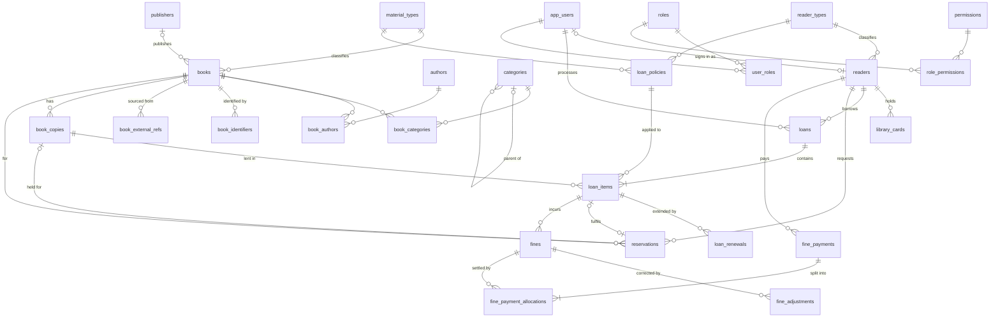

# Data Model: Core Library Data Model and ERD

**Feature**: `001-library-db-design` | **Date**: 2026-09-24 | **Spec**: [spec.md](./spec.md) |
**Research**: [research.md](./research.md)

Conventions (research R1, R2, R9):

- MySQL 8.4 (Docker image `mysql:8.4`), InnoDB, `utf8mb4` / `utf8mb4_0900_ai_ci`.
- Primary entities have `id BIGINT AUTO_INCREMENT` PKs. Junction tables use composite PKs (FR-023).
- Times are `DATETIME(3)` in UTC. Money is `BIGINT` VND.
- All FKs are `ON DELETE RESTRICT ON UPDATE RESTRICT` (FR-021).
- Enumerations are MySQL `ENUM` (strict mode rejects unknown values).
- **Tier** column: C = Core schema; E = table in the Core schema whose workflow is Ext.
- Rule ids (R-xx, I-x, US-x) refer to the spec.

## Conceptual model (source for the Chen ERD, `docs/erd/conceptual.puml`)

Entity types (strong unless noted), with key attributes and notable attributes:

| Entity | Key | Notable attributes |
| --- | --- | --- |
| MATERIAL TYPE | code | name |
| PUBLISHER | (surrogate) | name |
| AUTHOR | (surrogate) | name |
| CATEGORY | (surrogate) | name |
| BOOK (edition) | (surrogate) | title, subtitle, published date, description, language, cover, classification, replacement cost, status; **multi-valued**: identifiers {type, value} |
| COPY | barcode | shelf, acquired date, condition, circulation status |
| EXTERNAL REFERENCE (weak on BOOK for the report's purpose) | (provider, external id) | snapshot, view rights, fetched at |
| ACCOUNT | Supabase user id | status |
| ROLE / PERMISSION | code | name / description |
| READER TYPE | code | name |
| READER | (surrogate) | full name, email, phone, status |
| LIBRARY CARD | card number | issued, expires, status |
| LOAN POLICY VERSION | (surrogate) | limits, loan days, renewals, fee, debt threshold, validity period |
| LOAN | (surrogate) | borrowed at, status |
| LOAN ITEM | (surrogate) | due, returned, return condition, lost declared, status, renewal count, applied snapshot |
| RENEWAL | (surrogate) | old due, new due, renewed at |
| RESERVATION [Ext] | (surrogate) | requested, status, ready, hold expiry, close reason |
| FINE | (surrogate) | type, default amount, assessed amount, reason, assessed at |
| FINE ADJUSTMENT | (surrogate) | signed amount, reason, adjusted at |
| PAYMENT | request key | amount, paid at, method, reference |

Relationship types (Chen diamonds) with cardinality (min,max) on each side:

| Relationship | Participants and cardinality | Maps to |
| --- | --- | --- |
| WRITTEN_BY (attr: order) | BOOK (1,n) — AUTHOR (0,n) | junction `book_authors` |
| CLASSIFIED_IN | BOOK (0,n) — CATEGORY (0,n) | junction `book_categories` |
| SUBCATEGORY_OF | CATEGORY child (0,1) — CATEGORY parent (0,n) | `categories.parent_id` |
| PUBLISHED_BY | BOOK (0,1) — PUBLISHER (0,n) | `books.publisher_id` |
| OF_TYPE | BOOK (1,1) — MATERIAL TYPE (0,n) | `books.material_type_id` |
| HAS_COPY | COPY (1,1) — BOOK (0,n) | `book_copies.book_id` |
| SOURCED_FROM | EXTERNAL REFERENCE (1,1) — BOOK (0,n) | `book_external_refs.book_id` |
| (multi-valued attribute) identifiers | BOOK — {identifier} | relation `book_identifiers` |
| SIGNS_IN_AS | READER (0,1) — ACCOUNT (0,1) | `readers.user_id` UQ |
| IS_OF_TYPE | READER (1,1) — READER TYPE (0,n) | `readers.reader_type_id` |
| HOLDS | CARD (1,1) — READER (0,n) | `library_cards.reader_id` |
| HAS_ROLE | ACCOUNT (0,n) — ROLE (0,n) | junction `user_roles` |
| GRANTS | ROLE (0,n) — PERMISSION (0,n) | junction `role_permissions` |
| GOVERNS | POLICY VERSION (1,1) — READER TYPE (0,n), MATERIAL TYPE (0,n) | two FKs on `loan_policies` |
| BORROWS | LOAN (1,1) — READER (0,n) | `loans.reader_id` |
| PROCESSES | LOAN (1,1) — ACCOUNT (0,n) | `loans.processed_by_user_id` |
| CONTAINS | LOAN ITEM (1,1) — LOAN (1,n) | `loan_items.loan_id` |
| LENDS | LOAN ITEM (1,1) — COPY (0,n) | `loan_items.copy_id` |
| APPLIES | LOAN ITEM (1,1) — POLICY VERSION (0,n) | `loan_items.policy_id` |
| EXTENDS | RENEWAL (1,1) — LOAN ITEM (0,n) | `loan_renewals.loan_item_id` |
| REQUESTS [Ext] | RESERVATION (1,1) — READER (0,n); RESERVATION (1,1) — BOOK (0,n) | FKs on `reservations` |
| HELD_AS [Ext] | RESERVATION (0,1) — COPY (0,n) | `reservations.assigned_copy_id` |
| INCURS | FINE (1,1) — LOAN ITEM (0,n) | `fines.loan_item_id` |
| CORRECTS | ADJUSTMENT (1,1) — FINE (0,n) | `fine_adjustments.fine_id` |
| PAYS | PAYMENT (1,1) — READER (0,n) | `fine_payments.reader_id` |
| SETTLES (attr: amount) | PAYMENT (1,n) — FINE (0,n) | junction `fine_payment_allocations` |
| staff actions | RENEWAL, FINE, ADJUSTMENT, PAYMENT, POLICY VERSION, RESERVATION (1,1 or 0,1) — ACCOUNT (0,n) | actor FK columns |

Technical additions that are not ERD elements (documented in `docs/erd/mapping.md`): the
generated columns `active_reader_id`, `open_copy_id`, `active_flag`, `ready_copy_id`;
`created_at`/`updated_at`; the snapshot columns on `loan_items` (they belong to LOAN ITEM but
exist to freeze history).

## Relational diagram (design sketch; the committed diagram is generated from the live schema)

Staff-actor FKs to `app_users` also exist on `loan_renewals`, `fines`, `fine_adjustments`,
`fine_payments`, `loan_policies` and `reservations`. They are omitted from the diagram to keep it
readable and listed per table below.

## Tables

Notation: **PK**, **FK→table**, **UQ** unique, **IX** secondary index, **CK** check,
**GEN** generated STORED column. NULL means optional; all other columns are NOT NULL.

### Catalog

**material_types** (C) — *A kind of library material.*
`id` PK · `code` VARCHAR(32) UQ · `name` VARCHAR(100). Seed: `BOOK_PRINT`.

**publishers** (C) — *An organisation that publishes editions.*
`id` PK · `name` VARCHAR(255) · IX(`name`).

**authors** (C) — *A person or organisation credited on books.*
`id` PK · `name` VARCHAR(255) · IX(`name`).

**categories** (C) — *A subject category, optionally under a parent.*
`id` PK · `name` VARCHAR(150) · `parent_id` FK→categories NULL · UQ(`parent_id`, `name`).

**books** (C) — *Book `id` is one catalogued edition owned by the library.*

| Column | Type | Notes |
| --- | --- | --- |
| id | BIGINT | PK |
| title | VARCHAR(500) | |
| subtitle | VARCHAR(500) NULL | |
| publisher_id | BIGINT NULL | FK→publishers |
| published_date_text | VARCHAR(10) NULL | `YYYY`, `YYYY-MM` or `YYYY-MM-DD` as supplied |
| published_year | SMALLINT NULL | CK 1000–2100; for filtering |
| description | TEXT NULL | |
| language_code | VARCHAR(8) NULL | BCP-47 short code |
| cover_url | VARCHAR(1000) NULL | |
| material_type_id | BIGINT | FK→material_types |
| classification_code | VARCHAR(50) NULL | library-owned |
| replacement_cost_vnd | BIGINT NULL | CK ≥ 0; library-owned |
| status | ENUM('active','retired') | books with history are retired, not deleted |
| created_at, updated_at | DATETIME(3) | |

IX(`title`), IX(`published_year`), FULLTEXT(`title`, `subtitle`) for search.

**book_authors** (C, junction) — PK(`book_id`, `author_id`) · FK→books, FK→authors ·
`author_order` TINYINT UNSIGNED CK ≥ 1 · UQ(`book_id`, `author_order`) · IX(`author_id`).

**book_categories** (C, junction) — PK(`book_id`, `category_id`) · IX(`category_id`).

**book_identifiers** (C) — *Book `book_id` carries identifier `(type, value)`.*
`id` PK · `book_id` FK · `identifier_type` ENUM('ISBN_10','ISBN_13','OTHER') ·
`identifier_value` VARCHAR(64) · UQ(`book_id`, `identifier_type`, `identifier_value`) ·
IX(`identifier_type`, `identifier_value`). Not globally unique (FR-003); the import warns on hits.

**book_external_refs** (C) — *Book `book_id` was sourced from provider record `external_id`;
the snapshot was fetched at `fetched_at`.*
`id` PK · `book_id` FK · `provider` ENUM('GOOGLE_BOOKS') · `external_id` VARCHAR(64) ·
`source_url` VARCHAR(1000) NULL · `viewability` ENUM('PARTIAL','ALL_PAGES','NO_PAGES','UNKNOWN')
NULL · `embeddable` BOOLEAN NULL · `web_reader_link` VARCHAR(1000) NULL · `access_country`
CHAR(2) NULL · `raw_snapshot` JSON · `fetched_at` DATETIME(3) · **UQ(`provider`,`external_id`)**
(R-03) · IX(`book_id`).

**book_copies** (C) — *Copy `barcode` is one physical item of book `book_id`.*

| Column | Type | Notes |
| --- | --- | --- |
| id | BIGINT | PK; also UQ(`id`, `book_id`) as the target of the reservations composite FK |
| book_id | BIGINT | FK→books |
| barcode | VARCHAR(32) | **UQ** (R-01) |
| shelf_code | VARCHAR(50) NULL | |
| acquired_at | DATE NULL | |
| physical_condition | ENUM('good','worn','damaged') | named `physical_condition` because `CONDITION` is a MySQL reserved word |
| circulation_status | ENUM('available','on_loan','on_hold','in_repair','lost','retired') | |
| created_at, updated_at | DATETIME(3) | |

CK `NOT (physical_condition = 'damaged' AND circulation_status IN ('available','on_hold','on_loan'))`
(R-06a, I-7) · IX(`book_id`, `circulation_status`).

### People, identity, access

**app_users** (C) — *Supabase user `supabase_user_id` is known to the library as account `id`.*
`id` PK · `supabase_user_id` CHAR(36) **UQ** (R-19a; no FK to `auth.users`) ·
`status` ENUM('active','inactive') · `created_at`.

**roles** / **permissions** (C) — `id` PK · `code` VARCHAR(64) UQ · `name`/`description`.
Permission seed: `catalog.write`, `catalog.import`, `card.manage`, `loan.checkout`,
`loan.return`, `loan.renew`, `fine.collect`, `policy.manage`, `role.manage`, `report.read`,
`fine.adjust`, `reservation.manage` (E). Role seed: `admin` (all), `librarian` (all except
`policy.manage`, `role.manage`), `reader` (none; [Ext] `sp_reserve` lets a reader act on their own record).

**user_roles** (C, junction) — PK(`user_id`, `role_id`) · IX(`role_id`).
**role_permissions** (C, junction) — PK(`role_id`, `permission_id`) · IX(`permission_id`).

**reader_types** (C) — `id` PK · `code` VARCHAR(32) UQ · `name`. Seed: STUDENT, LECTURER,
EXTERNAL.

**readers** (C) — *Reader `id` of type `reader_type_id` may borrow from the library.*
`id` PK · `user_id` FK→app_users NULL **UQ** (one reader per account) · `reader_type_id` FK ·
`full_name` VARCHAR(200) · `email` VARCHAR(320) NULL · `phone` VARCHAR(20) NULL ·
`status` ENUM('active','suspended','inactive') · `created_at`.

**library_cards** (C) — *Card `card_number` was issued to reader `reader_id`, valid until
`expires_at` while `active`.*
`id` PK · `reader_id` FK · `card_number` VARCHAR(32) **UQ** (R-08a) · `issued_at` ·
`expires_at` · `status` ENUM('active','expired','lost','revoked') · `created_at` ·
GEN `active_reader_id` = `IF(status='active', reader_id, NULL)` **UQ** (R-08c) ·
CK `expires_at > issued_at` (R-08b).

### Policies

**loan_policies** (C) — *Between `valid_from` (inclusive) and `valid_to` (exclusive), readers of
type `reader_type_id` borrowing material `material_type_id` follow these values.*

| Column | Type | Notes |
| --- | --- | --- |
| id | BIGINT | PK |
| reader_type_id, material_type_id | BIGINT | FKs |
| max_active_items | SMALLINT | CK > 0 |
| loan_days | SMALLINT | CK > 0 |
| max_renewals | SMALLINT | CK ≥ 0 |
| daily_late_fee_vnd | BIGINT | CK ≥ 0 |
| debt_block_threshold_vnd | BIGINT | CK ≥ 0 |
| valid_from | DATETIME(3) | |
| valid_to | DATETIME(3) NULL | CK `valid_to IS NULL OR valid_to > valid_from` (R-09b) |
| created_by_user_id | BIGINT | FK→app_users |
| created_at | DATETIME(3) | |

IX(`reader_type_id`, `material_type_id`, `valid_from`). No overlap (R-09a): a transaction locks
the `reader_types` row, plus trigger guard `trg_loan_policies_bi`. Immutability (R-09c):
`trg_loan_policies_bu`. Referenced rows cannot be deleted (R-09d via FK from `loan_items`).

### Circulation

**loans** (C) — *Staff `processed_by_user_id` lent items to reader `reader_id` at `borrowed_at`.*
`id` PK · `reader_id` FK · `processed_by_user_id` FK→app_users · `borrowed_at` ·
`status` ENUM('open','closed') · `created_at` · IX(`reader_id`, `status`),
IX(`reader_id`, `borrowed_at`).

**loan_items** (C) — *Copy `copy_id` was lent in loan `loan_id` under policy `policy_id`, due
`due_at`.*

| Column | Type | Notes |
| --- | --- | --- |
| id | BIGINT | PK |
| loan_id | BIGINT | FK→loans |
| copy_id | BIGINT | FK→book_copies |
| policy_id | BIGINT | FK→loan_policies |
| borrowed_at | DATETIME(3) | equals the loan's `borrowed_at` |
| due_at | DATETIME(3) | CK `due_at > borrowed_at` |
| returned_at | DATETIME(3) NULL | CK `returned_at IS NULL OR returned_at >= borrowed_at` |
| return_condition | ENUM('good','worn','damaged') NULL | |
| lost_declared_at | DATETIME(3) NULL | CK `lost_declared_at IS NULL OR lost_declared_at >= borrowed_at` |
| status | ENUM('on_loan','returned','lost') | |
| renewal_count | SMALLINT | CK `0 ≤ renewal_count ≤ applied_max_renewals` |
| applied_loan_days | SMALLINT | snapshot, CK > 0 |
| applied_max_renewals | SMALLINT | snapshot, CK ≥ 0 |
| applied_daily_fee_vnd | BIGINT | snapshot, CK ≥ 0 |
| open_copy_id | GEN | `IF(status='on_loan', copy_id, NULL)` **UQ** (R-12a) |

Status consistency CK (R-11b):
`(status='on_loan' AND returned_at IS NULL AND return_condition IS NULL AND lost_declared_at IS NULL)
OR (status='returned' AND returned_at IS NOT NULL AND return_condition IS NOT NULL AND lost_declared_at IS NULL)
OR (status='lost' AND lost_declared_at IS NOT NULL AND returned_at IS NULL)`.

Indexes: IX(`copy_id`, `status`), IX(`status`, `due_at`) for overdue queries, IX(`loan_id`),
IX(`policy_id`, `borrowed_at`) for R-09e.

**loan_renewals** (C) — *Loan item `loan_item_id` was extended from `old_due_at` to `new_due_at`.*
`id` PK · `loan_item_id` FK · `old_due_at` · `new_due_at` · `renewed_at` ·
`performed_by_user_id` FK→app_users · CK `new_due_at > old_due_at` (R-13a) · IX(`loan_item_id`).

**reservations** (E) — *Reader `reader_id` queued for book `book_id` at `requested_at`.*

| Column | Type | Notes |
| --- | --- | --- |
| id | BIGINT | PK |
| reader_id, book_id | BIGINT | FKs |
| requested_at | DATETIME(3) | |
| status | ENUM('waiting','ready','fulfilled','cancelled','expired') | |
| assigned_copy_id | BIGINT NULL | composite FK (`assigned_copy_id`, `book_id`) → book_copies(`id`, `book_id`) (R-14c) |
| ready_at, hold_expires_at | DATETIME(3) NULL | |
| fulfilled_loan_item_id | BIGINT NULL | FK→loan_items, UQ |
| closed_at | DATETIME(3) NULL | |
| close_reason | VARCHAR(64) NULL | e.g. `ineligible_at_promotion`, `hold_expired`, `reader_cancelled` |
| closed_by_kind | ENUM('staff','reader','system') NULL | |
| closed_by_user_id | BIGINT NULL | FK→app_users |
| active_flag | GEN | `IF(status IN ('waiting','ready'), 1, NULL)`; **UQ(`reader_id`,`book_id`,`active_flag`)** (R-14a) |
| ready_copy_id | GEN | `IF(status='ready', assigned_copy_id, NULL)` **UQ** (R-14d) |

CKs (R-14b):
- `status <> 'ready' OR (assigned_copy_id IS NOT NULL AND ready_at IS NOT NULL AND hold_expires_at IS NOT NULL AND hold_expires_at > ready_at)` (a NULL CHECK result counts as satisfied, so NOT NULL is explicit)
- `status <> 'fulfilled' OR fulfilled_loan_item_id IS NOT NULL`
- `status NOT IN ('cancelled','expired','fulfilled') OR closed_at IS NOT NULL`

IX(`book_id`, `status`, `requested_at`, `id`) is the queue order (FR-014b).

### Fines and payments

**fines** (C) — *Loan item `loan_item_id` incurred a `fine_type` fine of `assessed_amount_vnd`.*

| Column | Type | Notes |
| --- | --- | --- |
| id | BIGINT | PK |
| loan_item_id | BIGINT | FK→loan_items |
| fine_type | ENUM('late','damaged','lost') | UQ(`loan_item_id`, `fine_type`) (R-15a) |
| default_amount_vnd | BIGINT | CK ≥ 0 |
| assessed_amount_vnd | BIGINT | CK ≥ 0 |
| reason | VARCHAR(500) NULL | CK `assessed_amount_vnd = default_amount_vnd OR (reason IS NOT NULL AND CHAR_LENGTH(TRIM(reason)) > 0)` (R-15c) |
| assessed_at | DATETIME(3) | |
| assessed_by_user_id | BIGINT | FK→app_users |

IX(`assessed_at`) for period reports. No stored status (FR-015). Remaining balance = assessed + Σ adjustments − Σ allocations.

**fine_adjustments** (C) — `id` PK · `fine_id` FK · `amount_vnd` BIGINT CK ≠ 0 ·
`reason` VARCHAR(500) CK non-blank · `adjusted_by_user_id` FK · `adjusted_at` · IX(`fine_id`).

**fine_payments** (C) — *Staff `received_by_user_id` received `amount_vnd` from reader `reader_id`.*
`id` PK · `reader_id` FK · `received_by_user_id` FK · `amount_vnd` BIGINT CK > 0 · `paid_at` ·
`method` ENUM('cash','bank_transfer') · `reference_no` VARCHAR(64) NULL ·
`request_key` VARCHAR(64) **UQ** (R-16e) · `created_at` · IX(`reader_id`, `paid_at`),
IX(`paid_at`).

**fine_payment_allocations** (C, junction) — PK(`payment_id`, `fine_id`) · FKs ·
`amount_vnd` BIGINT CK > 0 (R-16a) · IX(`fine_id`).

## Triggers (custom migration; all raise `SIGNAL SQLSTATE '45000'` with a stable message key)

| Trigger | Tier | Guards |
| --- | --- | --- |
| `trg_book_copies_bu` | C | (old, new) status pair allowed by the lifecycle table (R-06b); entering `on_loan` requires an `on_loan` item for the copy; leaving `on_loan` requires none (R-12c) |
| `trg_loan_items_bi` | C | new row status `on_loan`; copy status `available` or `on_hold` |
| `trg_loan_items_bu` | C | `loan_id`, `copy_id`, `policy_id`, `borrowed_at` and `applied_*` unchanged (R-11a); status only `on_loan→returned` or `on_loan→lost` (R-11c); `due_at` changes only while `on_loan` and only increases |
| `trg_loan_policies_bi` | C | no overlapping version for the pair (bypass guard for R-09a) |
| `trg_loan_policies_bu` | C | business columns unchanged; `valid_to` only NULL→value or moved earlier (R-09c) |
| `trg_fines_bi` | C | a `damaged` and a `lost` fine cannot coexist for one loan item (R-15b guard) |
| `trg_fines_bu`, `trg_fines_bd` | C | reject every UPDATE/DELETE (R-17b) |
| `trg_fine_payments_bu/bd`, `trg_fine_payment_allocations_bu/bd` | C | reject every UPDATE/DELETE (R-17b) |
| `trg_fine_payment_allocations_bi` | C | Σ for the payment ≤ payment amount; Σ for the fine ≤ fine net amount (R-16c guard) |
| `trg_fine_adjustments_bi` | C | net amount after the insert ≥ allocated ≥ 0 (R-17a guard) |
| `trg_fine_adjustments_bu/bd` | C | reject every UPDATE/DELETE |
| `trg_reservations_bu` | E | status transitions per the reservation lifecycle |

## Stored routines

Signatures, behaviour and error keys are in [contracts/db-routines.md](./contracts/db-routines.md).

- **Functions (C)**: `fn_local_date`, `fn_due_at`, `fn_days_late`, `fn_late_fee`,
  `fn_fine_net`, `fn_fine_remaining`, `fn_reader_outstanding`, `fn_has_permission`.
- **Operation procedures (C)**: `sp_create_policy_version`, `sp_close_policy_version`,
  `sp_issue_card`, `sp_set_card_status`, `sp_register_copy`, `sp_change_copy_status`,
  `sp_checkout`, `sp_return_item`, `sp_declare_lost`, `sp_renew`, `sp_record_payment`,
  `sp_adjust_fine`.
- **Operation procedures (E)**: `sp_reserve`, `sp_cancel_reservation`.
- **Internal helpers (C/E)**: `sp__assess_fines` (C), `sp__promote_queue` (E),
  `sp__expire_holds_batch(p_now, OUT p_count)` (E). The first two run inside the caller's transaction. None is
  granted to `$DB_USER`.
- **Event (E)**: `ev_expire_holds` runs `sp__expire_holds_batch(UTC_TIMESTAMP(3), @expired_count)` every 15
  minutes (FR-014c).
- **Cursor batches**: `sp_expire_cards` (C), `sp_expire_holds` (E).
- **Report procedures (C)**: `sp_report_cumulative`, `sp_report_rollforward`.

## Invariant views (custom migration; each MUST return zero rows)

`v_inv_copy_on_loan` (I-1), `v_inv_copy_on_hold` (I-2, E), `v_inv_queue_available` (I-3, E),
`v_inv_loan_status` (I-4), `v_inv_fine_balance` (I-5), `v_inv_payment_allocation` (I-6),
`v_inv_damaged_lendable` (I-7), `v_inv_cards_policies` (I-8), `v_inv_borrow_in_policy` (I-9).

## Privileges (research R6)

| Account | Grants |
| --- | --- |
| `root` | MySQL root (password `MYSQL_ROOT_PASSWORD`), the owner; creates `${DB_NAME}_test` and scratch schemas; runs migrations and `scripts/db/grants.ts`; DEFINER of every trigger, routine, view and event; seeds reference data (material types, reader types, roles, permissions, role_permissions) in migrations |
| `$DB_USER` | SELECT on all tables and views; INSERT/UPDATE/DELETE **only** on `books`, `authors`, `publishers`, `categories`, `book_authors`, `book_categories`, `book_identifiers`, `book_external_refs`, `readers`, `app_users`, `user_roles`; EXECUTE on every `fn_*` / `sp_*` routine except internal `sp__*` helpers. All app grants are applied by `scripts/db/grants.ts` from `src/lib/db/grants.ts` with the account name from `DB_USER`; migrations never name an account (FR-030). **No** direct writes to `book_copies`, `library_cards`, `loan_policies`, `loans`, `loan_items`, `loan_renewals`, `reservations`, `fines`, `fine_adjustments`, `fine_payments`, `fine_payment_allocations` (R-26) |

## State transitions

Copy, loan item and reservation lifecycles are exactly the tables in the spec (section
"Lifecycles"). The allowed copy pairs enforced by `trg_book_copies_bu` are:

| From \ To | available | on_loan | on_hold | in_repair | lost | retired |
| --- | --- | --- | --- | --- | --- | --- |
| available | — | ✓ | ✓ (E, new queue) | ✓ | — | ✓ |
| on_loan | ✓ | — | ✓ (E) | ✓ | ✓ | — |
| on_hold (E) | ✓ | ✓ | ✓ (reassign) | — | — | — |
| in_repair | ✓ | — | ✓ (E) | — | — | ✓ |
| lost | ✓ | — | ✓ (E) | ✓ | — | ✓ |
| retired | — | — | — | — | — | — |

A new copy is inserted (not updated) as `available`, or as `in_repair` when its condition is
`damaged` (spec lifecycle rows "(new)"), so the BEFORE UPDATE trigger does not apply to it.
`available → on_hold` exists only for a copy registered or restored while a queue exists, when
promotion runs in the same transaction; `on_hold → on_hold` is the hold passed to the next reader
(same status, different reservation).

## Derived quantities (FR-018, reports)

- *Fine net* = `assessed_amount_vnd + Σ fine_adjustments.amount_vnd`.
- *Fine allocated* = `Σ fine_payment_allocations.amount_vnd`.
- *Fine remaining* = net − allocated; settled when 0.
- *Reader outstanding(T)* = Σ net(records ≤ T) − Σ payments(`paid_at` ≤ T).
- *Period roll-forward* `[A,B)` = opening(A) + assessed in period + adjustments in period −
  collected in period = closing(B).
- *Overdue* = `status='on_loan' AND due_at < now`.
- *Open items of a reader* = `loan_items` joined to `loans` with `loans.reader_id = ?` and
  `loan_items.status = 'on_loan'`.
